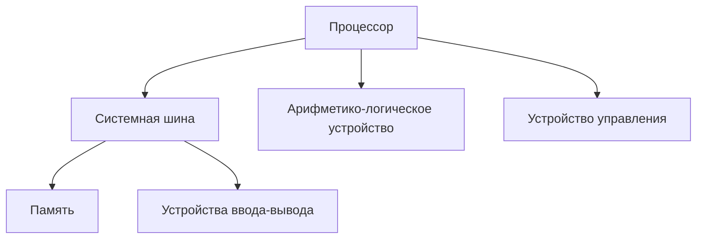
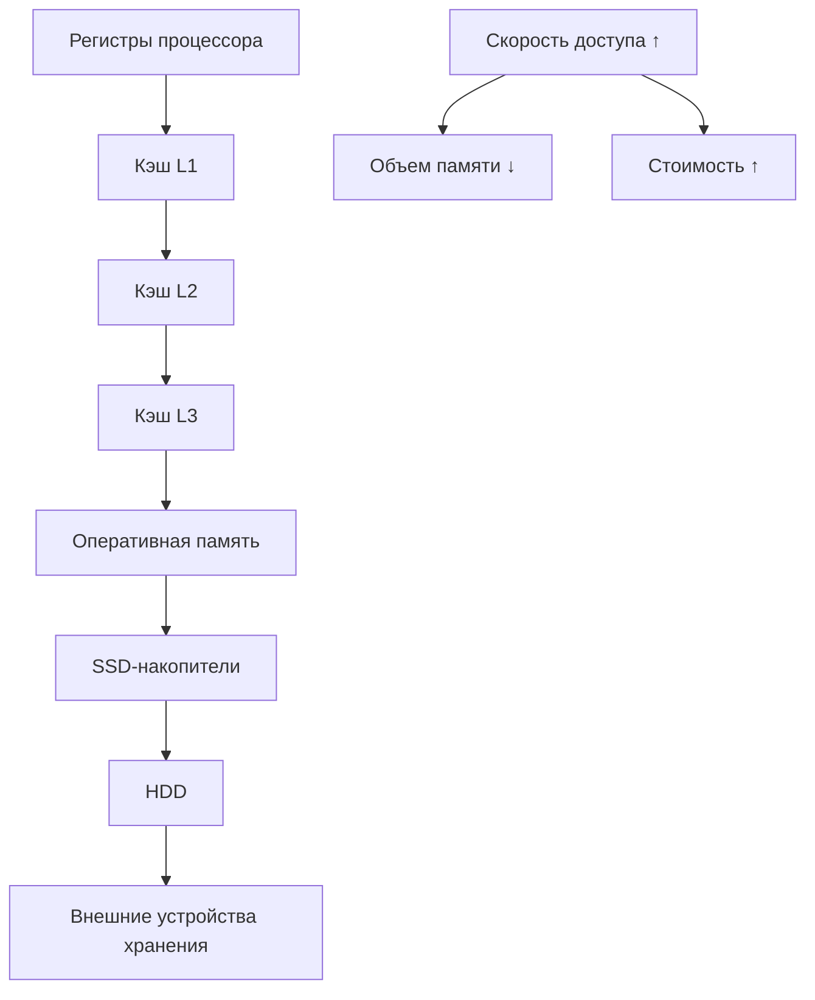
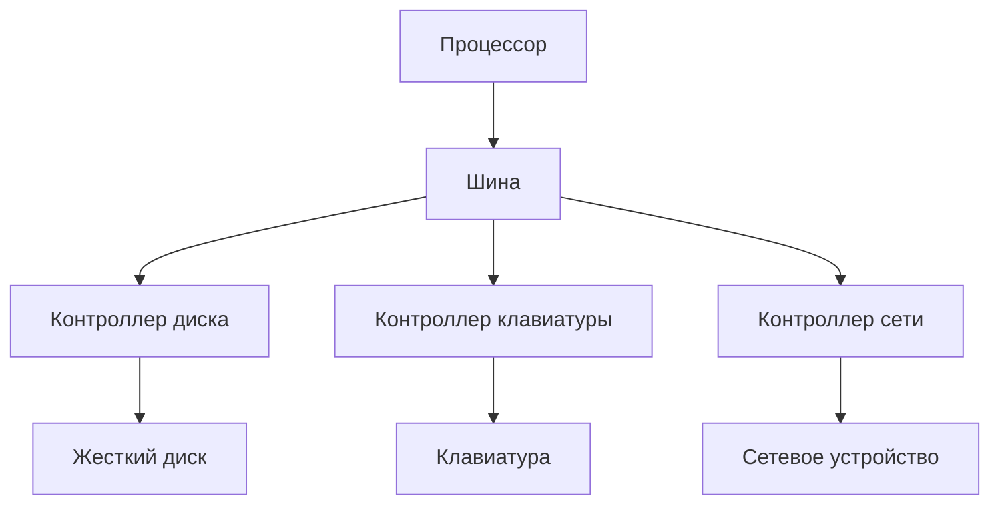

# Архитектура вычислительных систем

## 1. **Основные понятия и определения архитектуры ЭВМ. Принципы фон Неймана и классическая архитектура компьютера.**

Архитектура ЭВМ — это совокупность принципов организации вычислительной системы, определяющая взаимосвязь и функционирование её основных логических узлов.

Основные понятия архитектуры:
- Структура системы — состав компонентов и связи
- Организация — функциональные характеристики блоков
- Реализация — технические решения

Принципы фон Неймана:
- **Принцип хранимой программы** — программы и данные хранятся в одной памяти
- **Принцип двоичного кодирования** — вся информация представлена в двоичной системе
- **Принцип адресности** — память состоит из пронумерованных ячеек
- **Принцип программного управления** — команды выполняются последовательно
- **Принцип однородности памяти** — программы могут обрабатываться как данные

Классическая архитектура компьютера включает:
- **Процессор**: АЛУ (выполняет вычисления) и устройство управления (координирует работу)
- **Память**: оперативная (RAM) и постоянная (ROM)
- **Устройства ввода-вывода**: обеспечивают взаимодействие с внешним миром
- **Системная шина**: объединяет все компоненты (шины данных, адреса, управления)



## 2. **Уровень архитектуры команд ЭВМ. Структура и форматы машинных команд. Язык низкого уровня ассемблер.**

Уровень архитектуры команд (ISA) определяет:
- **Набор допустимых команд** — все операции, которые может выполнять процессор
- **Способы адресации памяти**: 
  - Прямая (MOV AX, [100])
  - Косвенная (MOV AX, [BX])
  - Регистровая (MOV AX, BX)
  - Индексная (MOV AX, [BX+SI])
  - Относительная (JMP +10)
- **Набор регистров** — специальные ячейки памяти внутри процессора
- **Форматы данных** — типы данных, с которыми работает процессор

Структура машинной команды включает:
- **Код операции (опкод)** — указывает, какую операцию нужно выполнить
- **Адресную часть** — содержит информацию об операндах и режимах адресации

Форматы машинных команд бывают:
- **Одноадресные** — один операнд, второй в аккумуляторе (INC A)
- **Двухадресные** — два операнда: источник и приемник (MOV A, B)
- **Трехадресные** — два источника и приемник (ADD R1, R2, R3)
- **Безадресные** — не требуют операндов (RET)

Ассемблер — это язык программирования низкого уровня:
- Каждая инструкция соответствует одной машинной команде
- Используются мнемоники вместо двоичных кодов (MOV, ADD, JMP)
- Позволяет напрямую работать с регистрами и памятью
- Включает директивы для ассемблера (DB, SEGMENT, PROC)

Пример простой программы на ассемблере:
```asm
section .data
    message db 'Hello, World!', 0

section .text
    global _start
_start:
    mov eax, 4      ; системный вызов для записи
    mov ebx, 1      ; стандартный вывод
    mov ecx, message; адрес строки
    mov edx, 13     ; длина строки
    int 0x80        ; вызов ядра
```

## 3. **Назначение и структура центрального процессора. Командный цикл процессора. Этапы исполнения команд процессором.**

Центральный процессор (ЦП) — это основной вычислительный компонент компьютера:
- Выполняет арифметические и логические операции
- Управляет потоком команд и данных
- Координирует работу всех устройств компьютера
- Обрабатывает прерывания

Структура ЦП включает:
- **АЛУ (арифметико-логическое устройство)** — выполняет вычислительные операции
- **Устройство управления** — координирует работу всех узлов процессора
- **Регистры** — сверхбыстрая память внутри процессора:
  - Регистры общего назначения
  - Счетчик команд (PC) — адрес следующей инструкции
  - Регистр команд (IR) — текущая выполняемая инструкция
  - Указатель стека (SP) — адрес вершины стека
  - Регистр состояния (флаги) — результаты операций (Z, C, V, S)
- **Кэш-память** — быстрая память для временного хранения данных (L1, L2, L3)
- **Шины** — для передачи данных между компонентами

Командный цикл процессора (цикл фон Неймана) включает:
1. **Выборка команды** — загрузка инструкции из памяти в регистр команд
2. **Декодирование** — определение типа операции и операндов
3. **Выборка операндов** — получение данных из регистров или памяти
4. **Исполнение** — выполнение операции в АЛУ или других блоках
5. **Запись результата** — сохранение результата в регистре или памяти
6. **Переход к следующей команде** — обновление счетчика команд


## 4. **Производительность центрального процессора. Характеристики микропроцессора. Способы повышения производительности.**

Основные характеристики процессора:
- **Тактовая частота** (ГГц) — число циклов в секунду (2-5 ГГц)
- **Разрядность** (32/64 бит) — размер обрабатываемых данных
- **Кэш-память** — быстрая память на кристалле:
  - L1: 32-64 КБ, самая быстрая
  - L2: 256-512 КБ на ядро
  - L3: 4-32 МБ общий для ядер
- **Количество ядер** — независимые вычислительные блоки (2-64 в массовых CPU)
- **IPC** (Instructions Per Cycle) — инструкций за такт (1-4 в среднем)
- **Набор инструкций** (x86-64, ARM) — поддерживаемые команды
- **Техпроцесс** (нм) — размер элементов на кристалле (4-7 нм современные)
- **TDP** (Вт) — тепловыделение процессора (15-125 Вт)

Способы повышения производительности:

1. **Конвейеризация** — одновременная обработка нескольких инструкций на разных стадиях:
   - Современные процессоры имеют 14-20 стадий конвейера
   - Увеличивает пропускную способность процессора

2. **Суперскалярная архитектура** — параллельное выполнение нескольких инструкций:
   - Несколько функциональных блоков работают одновременно
   - Динамическое планирование инструкций

3. **Многоядерность** — объединение нескольких процессорных ядер:
   - Каждое ядро выполняет свой поток инструкций
   - Эффективность зависит от распараллеливания задачи

4. **Оптимизация кэш-памяти**:
   - Увеличение размера кэша
   - Предвыборка данных (prefetching)
   - Оптимизация алгоритмов замещения

5. **Предсказание ветвлений** — прогнозирование условных переходов:
   - Статическое (на основе направления перехода)
   - Динамическое (на основе истории)
   - Снижает простои при ветвлениях

6. **SIMD-инструкции** — векторные операции над множеством элементов:
   - MMX, SSE, AVX, AVX-512 (x86-64)
   - NEON (ARM)
   - Одна инструкция обрабатывает несколько элементов данных

7. **Гиперпоточность** (SMT, Hyper-Threading) — выполнение двух потоков на одном ядре:
   - Использование простаивающих ресурсов ядра
   - Повышает загрузку исполнительных блоков

8. **Специализированные блоки**:
   - Векторные блоки
   - Криптографические ускорители
   - Блоки для искусственного интеллекта

## 5. **Устройства хранения информации. Классификация устройств хранения информации. Иерархическая структура памяти компьютера. Динамическая и статическая память.**

Классификация устройств хранения:
- **По принципу хранения**: электронные, магнитные, оптические
- **По доступу**: произвольный (RAM, HDD, SSD), последовательный (ленты)
- **По энергозависимости**: энергозависимые (RAM), энергонезависимые (ROM, HDD, SSD)
- **По назначению**: оперативные, постоянные, долговременные

Иерархия памяти компьютера (от быстрой к медленной):
1. **Регистры процессора** — сверхбыстрая память внутри ЦП (пикосекунды)
2. **Кэш L1** — очень быстрая память на кристалле (наносекунды)
3. **Кэш L2** — быстрая память второго уровня (десятки наносекунд)
4. **Кэш L3** — общая для всех ядер кэш-память (сотни наносекунд)
5. **Оперативная память (RAM)** — основная рабочая память (сотни наносекунд)
6. **SSD-накопители** — твердотельные накопители (микросекунды)
7. **HDD** — жесткие диски (миллисекунды)
8. **Внешние устройства хранения** — съемные носители (секунды и больше)



**Динамическая память (DRAM)**:
- Требует постоянного обновления (регенерации) для сохранения данных
- Один транзистор и конденсатор на бит
- Высокая плотность, дешевле SRAM
- Используется в оперативной памяти (RAM)

**Статическая память (SRAM)**:
- Хранит данные без обновления, пока подается питание
- Шесть транзисторов на бит
- Более быстрая, но дороже DRAM
- Используется в кэш-памяти процессора

## 6. **Система ввода-вывода. Шины, их характеристики. Порты. Контролеры.**

Система ввода-вывода обеспечивает взаимодействие процессора с внешними устройствами.

**Шины** — наборы проводников для передачи данных:
- **Шина данных** — передает данные между устройствами (двунаправленная)
- **Шина адреса** — передает адреса памяти или устройств (однонаправленная)
- **Шина управления** — передает управляющие сигналы (двунаправленная)

Характеристики шин:
- **Разрядность** — количество параллельных линий данных
- **Пропускная способность** — объем передаваемых данных в единицу времени
- **Частота работы** — число передач в секунду
- **Протокол** — набор правил взаимодействия устройств

**Порты** — точки подключения внешних устройств:
- **Физические порты**: USB, HDMI, DisplayPort, Ethernet, PCI, SATA
- **Логические порты**: адреса в пространстве ввода-вывода

**Контроллеры** — электронные схемы для управления устройствами:
- Преобразуют команды процессора в команды устройств
- Буферизуют данные между процессором и периферией
- Генерируют сигналы прерываний при завершении операций
- Выполняют протокольные преобразования

Методы ввода-вывода:
- **Программный ввод-вывод** — процессор ожидает завершения операции
- **Ввод-вывод по прерываниям** — устройство сигнализирует о завершении
- **DMA (прямой доступ к памяти)** — передача данных без участия процессора

