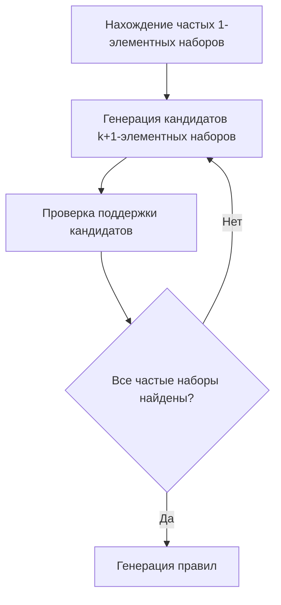
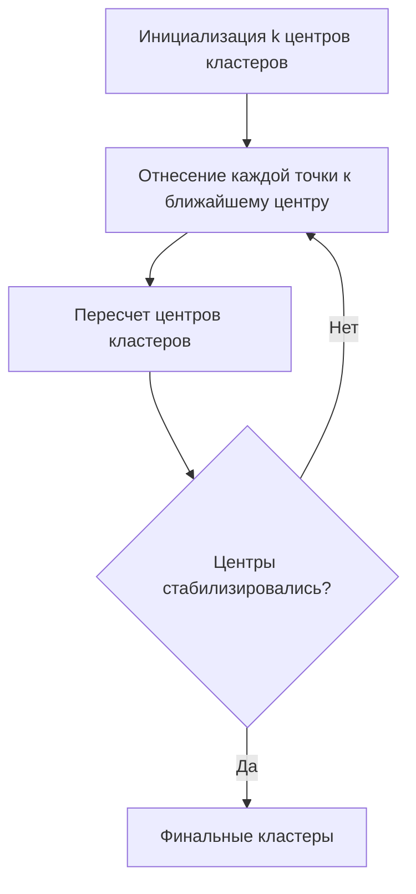
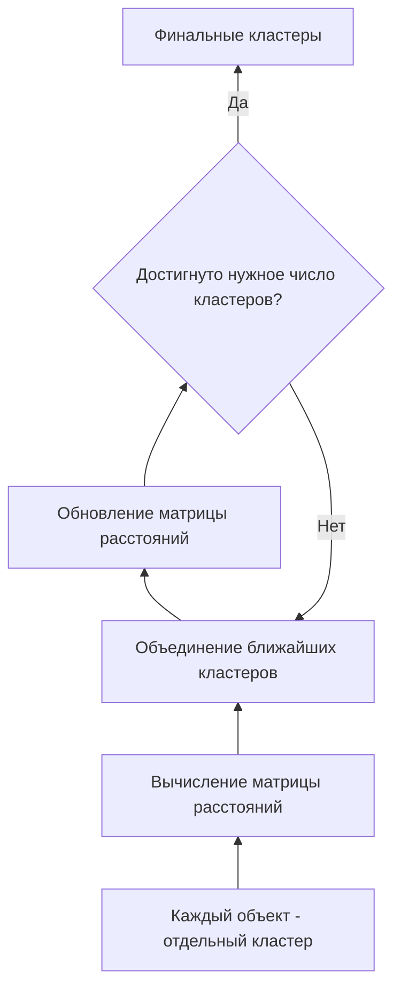
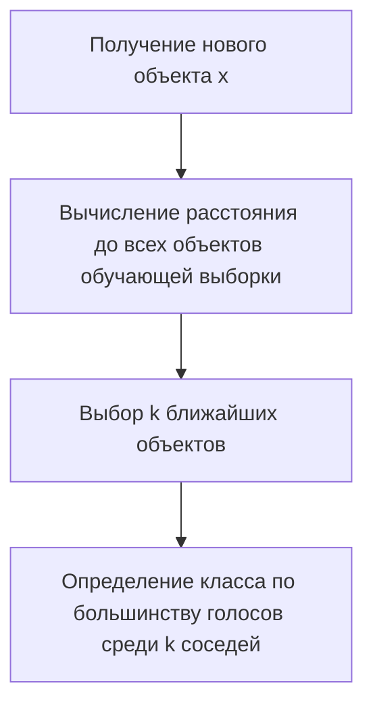
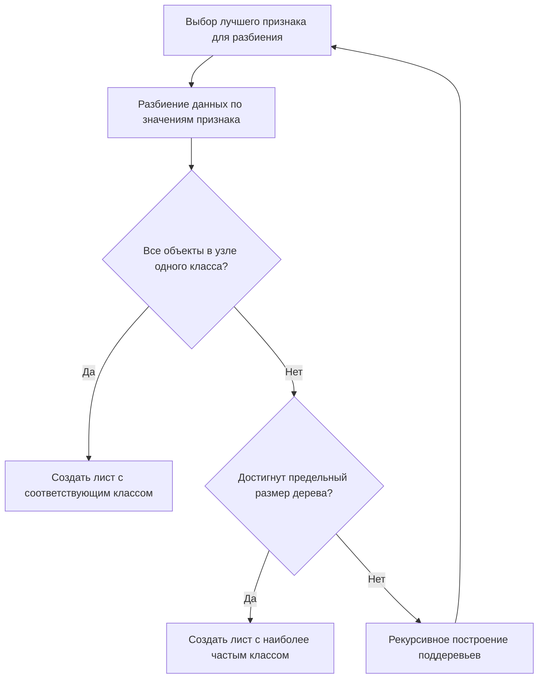
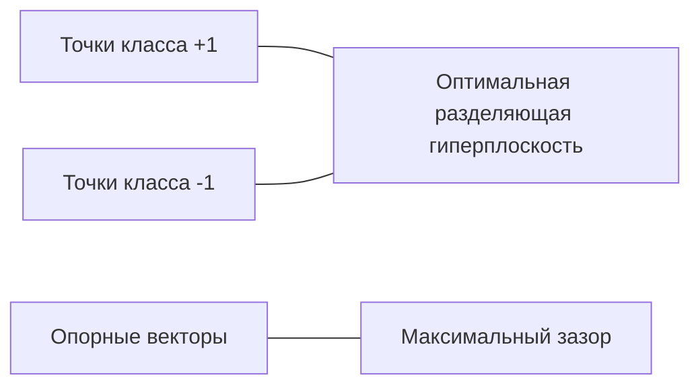

# Интеллектуальный анализ данных

## 1. Метод главных компонент

Метод главных компонент (PCA - Principal Component Analysis) - это статистическая процедура, использующая ортогональное преобразование для превращения набора наблюдений возможно коррелирующих переменных в набор линейно некоррелированных переменных, называемых главными компонентами.

### Направление с максимальной дисперсией

Первая главная компонента выбирается таким образом, чтобы объяснить наибольшую дисперсию в данных. Каждая последующая компонента имеет наивысшую дисперсию при условии ортогональности ко всем предыдущим компонентам.


### Минимальная среднеквадратичная ошибка

Метод главных компонент может рассматриваться как поиск подпространства малой размерности, при проекции на которое минимизируется среднеквадратичная ошибка аппроксимации данных. Формально, если $X$ - исходная матрица данных, а $\hat{X}$ - аппроксимация после проекции на подпространство главных компонент, то PCA минимизирует $||X - \hat{X}||^2$.

### Алгоритм метода главных компонент

1. **Подготовка данных**:
   - Центрирование данных (вычитание среднего из каждой переменной)
   - Опционально: масштабирование (деление на стандартное отклонение)

2. **Вычисление ковариационной матрицы**:
   - Для центрированных данных $X$ ковариационная матрица: $C = \frac{1}{n-1}X^TX$

3. **Нахождение собственных векторов и собственных значений**:
   - Решение уравнения $Cv = \lambda v$, где $v$ - собственный вектор, $\lambda$ - собственное значение

4. **Упорядочение собственных векторов**:
   - Сортировка собственных векторов по убыванию соответствующих собственных значений

5. **Выбор количества компонент**:
   - Определение необходимого количества компонент k, объясняющих достаточную долю дисперсии

6. **Проекция данных**:
   - Преобразование исходных данных с помощью матрицы главных компонент

## 2. Задача поиска ассоциативных правил

Поиск ассоциативных правил - это метод обнаружения интересных отношений между переменными в больших базах данных. Чаще всего используется для анализа потребительской корзины: "если клиент купил X, то он также купит Y с вероятностью Z".

### Поддержка и достоверность ассоциативного правила

- **Поддержка (support)** правила X → Y: доля транзакций, содержащих одновременно X и Y.
  
  Support(X → Y) = P(X ∩ Y) = количество транзакций содержащих X и Y / общее количество транзакций

- **Достоверность (confidence)** правила X → Y: доля транзакций, содержащих Y среди транзакций, содержащих X.
  
  Confidence(X → Y) = P(Y|X) = Support(X → Y) / Support(X)

- **Лифт (lift)** правила X → Y: отношение наблюдаемой достоверности к ожидаемой, если бы X и Y были независимы.
  
  Lift(X → Y) = Confidence(X → Y) / Support(Y)

### Алгоритмы Apriori, Eclat и dEclat

#### Алгоритм Apriori

Алгоритм Apriori использует последовательное формирование кандидатов в частые наборы и проверку их на соответствие минимальной поддержке.



Основные шаги:
1. Найти все частые 1-элементные наборы (превышающие минимальную поддержку)
2. Для каждого k ≥ 1:
   - Сгенерировать кандидаты в (k+1)-элементные наборы из частых k-элементных наборов
   - Отсечь кандидаты, содержащие нечастые подмножества
   - Подсчитать поддержку оставшихся кандидатов
   - Выбрать кандидаты, превышающие минимальную поддержку
3. Продолжать, пока не будут найдены все частые наборы

#### Алгоритм Eclat

Eclat (Equivalence CLAss Transformation) использует вертикальное представление данных, где для каждого элемента хранится список идентификаторов транзакций, в которых он присутствует.

Основное преимущество: вычисление поддержки через пересечение множеств идентификаторов транзакций, что более эффективно при обработке разреженных данных.

#### Алгоритм dEclat

dEclat (diffset-based Eclat) - модификация Eclat, использующая разностные множества (diffsets) вместо списков идентификаторов транзакций, что позволяет дополнительно снизить требования к памяти.

### Алгоритм построения ассоциативного правила

1. **Поиск частых наборов элементов**:
   - Определение наборов элементов, удовлетворяющих минимальной поддержке

2. **Генерация ассоциативных правил**:
   - Для каждого частого набора L генерируем правила вида L\H → H для всех непустых подмножеств H набора L
   - Оставляем только правила с достоверностью, превышающей порог

3. **Фильтрация правил**:
   - Применение дополнительных метрик (лифт, убеждение и др.)
   - Отбор наиболее интересных правил для бизнес-интерпретации

## 3. Задача кластеризации

Кластеризация - это задача разбиения множества объектов на группы (кластеры) таким образом, чтобы объекты в одной группе были более похожи друг на друга, чем на объекты из других групп.

### Алгоритм k-средних

K-средних (K-means) - один из самых популярных алгоритмов кластеризации, основанный на минимизации суммарного квадратичного отклонения точек кластеров от центров этих кластеров.



Алгоритм:
1. Выбрать k начальных центров кластеров
2. Отнести каждый объект к кластеру с ближайшим центром
3. Пересчитать центры кластеров как средние значения всех объектов в кластере
4. Повторять шаги 2-3 до сходимости (центры перестают значительно меняться)

### Алгоритм аггломеративной кластеризации

Аггломеративная кластеризация - это иерархический подход, начинающий с рассмотрения каждого объекта как отдельного кластера и последовательно объединяющий наиболее близкие кластеры.



Алгоритм:
1. Начать с n кластеров, каждый содержит ровно один объект
2. Найти два ближайших кластера и объединить их в один
3. Обновить матрицу расстояний между кластерами
4. Повторять шаги 2-3, пока не будет достигнуто желаемое количество кластеров или пока расстояние между ближайшими кластерами не превысит порог

Методы определения расстояния между кластерами:
- Метод одиночной связи (ближайший сосед): минимальное расстояние между объектами из разных кластеров
- Метод полной связи (дальний сосед): максимальное расстояние между объектами из разных кластеров
- Метод средней связи: среднее расстояние между всеми парами объектов из разных кластеров
- Метод Уорда: минимизация дисперсии внутри кластеров

### Меры качества кластеризации

#### Таблица сопряженности

Таблица сопряженности (contingency table) используется для оценки качества кластеризации, когда известны истинные метки классов. Она показывает, сколько объектов каждого истинного класса попало в каждый кластер.

Пример таблицы сопряженности для трех кластеров и трех истинных классов:

| Кластеры\Классы | Класс 1 | Класс 2 | Класс 3 |
|-----------------|---------|---------|---------|
| Кластер 1       | 45      | 2       | 5       |
| Кластер 2       | 3       | 40      | 2       |
| Кластер 3       | 7       | 5       | 43      |

#### Чистота кластеризации

Чистота (purity) - это мера, отражающая степень, в которой кластеры содержат объекты только одного класса. Для каждого кластера определяется преобладающий класс, и чистота вычисляется как доля правильно классифицированных объектов.

Формула для вычисления чистоты:

Purity = (1/N) * Σᵢ max_j |cᵢ ∩ t_j|

где:
- N - общее число объектов
- cᵢ - i-й кластер
- t_j - j-й истинный класс
- |cᵢ ∩ t_j| - число объектов класса j в кластере i

Чистота принимает значения от 0 до 1, при этом 1 означает идеальное соответствие кластеров истинным классам.

## 4. Задача классификации

Классификация - это задача определения категории (класса), к которой принадлежит новый объект, на основе обучающей выборки, содержащей объекты с известными метками классов.

### Обучающая и контрольная выборка

**Обучающая выборка** (training set) - набор данных, используемый для обучения модели. Содержит входные признаки и соответствующие им целевые значения (метки классов).

**Контрольная (тестовая) выборка** (test set) - независимый набор данных, используемый для оценки производительности обученной модели. Модель не имеет доступа к этим данным во время обучения.

Часто исходные данные разделяют на обучающую и тестовую выборки в пропорции 70-80% к 20-30%. Дополнительно может выделяться **валидационная выборка** для настройки гиперпараметров модели.

### Алгоритм байесовской классификации

Байесовская классификация основана на применении теоремы Байеса для вычисления апостериорной вероятности принадлежности объекта к определенному классу.

Теорема Байеса:
P(y|x) = P(x|y) * P(y) / P(x)

где:
- P(y|x) - вероятность класса y при наблюдении признаков x
- P(x|y) - вероятность наблюдения признаков x при условии класса y
- P(y) - априорная вероятность класса y
- P(x) - полная вероятность наблюдения признаков x

Алгоритм классификации выбирает класс с максимальной апостериорной вероятностью:
y* = argmax_y P(y|x) = argmax_y P(x|y) * P(y)

### Наивный байесовский классификатор

Наивный байесовский классификатор - это упрощенная версия байесовского классификатора, предполагающая условную независимость признаков при заданном классе.

Вероятность наблюдения набора признаков x = (x₁, x₂, ..., xₙ) при условии класса y рассчитывается как:
P(x|y) = P(x₁|y) * P(x₂|y) * ... * P(xₙ|y)

```mermaid
graph TD
    A[Обучение: расчет P(y) и P(xᵢ|y) для всех признаков i и классов y] --> B[Получение нового объекта с признаками x]
    B --> C[Расчет P(y|x) для всех классов y]
    C --> D[Выбор класса с максимальной P(y|x)]
```

Алгоритм:
1. **Обучение**:
   - Оценить априорные вероятности классов P(y)
   - Для каждого класса y и признака i оценить условные вероятности P(xᵢ|y)

2. **Классификация**:
   - Для нового объекта x вычислить P(y|x) для всех классов y
   - Выбрать класс с максимальной P(y|x)

### Метод K ближайших соседей

Метод k ближайших соседей (kNN) - это непараметрический метод классификации, основанный на сравнении нового объекта с k ближайшими к нему объектами обучающей выборки.



Алгоритм:
1. Рассчитать расстояние от нового объекта до всех объектов обучающей выборки
2. Выбрать k объектов с минимальным расстоянием (k ближайших соседей)
3. Присвоить новому объекту тот класс, который является наиболее распространенным среди его k ближайших соседей

Важные аспекты:
- Выбор метрики расстояния (евклидово, манхэттенское, косинусное и др.)
- Выбор параметра k (компромисс между обобщающей способностью и шумом)
- Возможность взвешивания голосов соседей обратно пропорционально их расстоянию

## 5. Классификатор дерева принятия решений

Дерево решений - это иерархическая структура, состоящая из узлов (атрибутов), ветвей (значений атрибутов) и листьев (решений). Каждый внутренний узел представляет проверку определенного признака, каждая ветвь - исход проверки, а каждый лист - класс.

### Алгоритм построения дерева принятия решений



Алгоритм ID3/C4.5/CART:
1. Выбрать "лучший" признак для разбиения данных (на основе энтропии, информационного выигрыша или индекса Джини)
2. Создать узел, соответствующий этому признаку
3. Разбить данные по значениям выбранного признака
4. Для каждого разбиения:
   - Если все объекты в подмножестве принадлежат одному классу, создать лист с этим классом
   - Если достигнут предельный размер дерева или нет подходящих признаков для дальнейшего разбиения, создать лист с наиболее частым классом
   - В противном случае рекурсивно построить поддерево
5. Объединить все поддеревья в общее дерево решений

### Оценка разбиения

#### Энтропия

Энтропия - мера неопределенности набора данных:

H(S) = -Σᵢ P(i) * log₂P(i)

где P(i) - доля объектов класса i в наборе S.

Энтропия принимает значения от 0 (все объекты одного класса) до log₂(k) (равномерное распределение объектов по k классам).

#### Информационный выигрыш

Информационный выигрыш - уменьшение энтропии после разбиения набора данных по определенному признаку:

Gain(S, A) = H(S) - Σᵥ |Sᵥ|/|S| * H(Sᵥ)

где:
- S - исходный набор данных
- A - признак для разбиения
- Sᵥ - подмножество S, в котором признак A имеет значение v
- H(S) - энтропия S
- H(Sᵥ) - энтропия Sᵥ

#### Индекс Джини

Индекс Джини - мера неоднородности набора данных:

Gini(S) = 1 - Σᵢ P(i)²

где P(i) - доля объектов класса i в наборе S.

Индекс Джини принимает значения от 0 (все объекты одного класса) до 1-1/k (равномерное распределение по k классам).

Для оценки разбиения по признаку A вычисляется взвешенная сумма индексов Джини для получаемых подмножеств:

GiniSplit(S, A) = Σᵥ |Sᵥ|/|S| * Gini(Sᵥ)

Выбирается признак, минимизирующий GiniSplit.

## 6. Метод опорных векторов

Метод опорных векторов (Support Vector Machine, SVM) - это алгоритм машинного обучения, который находит оптимальную гиперплоскость, разделяющую классы данных с максимальным зазором.

### Разделяющая гиперплоскость

Гиперплоскость в n-мерном пространстве определяется уравнением:
w·x + b = 0

где:
- w - вектор нормали к гиперплоскости
- x - вектор признаков точки данных
- b - свободный член

Для задачи бинарной классификации с метками классов y ∈ {-1, 1}, точка x классифицируется согласно функции:
f(x) = sign(w·x + b)

### Зазор и опорные векторы

Зазор (margin) - это расстояние между разделяющей гиперплоскостью и ближайшими к ней точками данных из разных классов.



Опорные векторы - это точки данных, которые лежат на границе зазора и определяют положение разделяющей гиперплоскости. Все остальные точки данных не влияют на положение гиперплоскости.

### Функция потерь

Функция потерь для метода опорных векторов с мягким зазором (soft margin SVM):

L(w, b) = (1/2)||w||² + C * Σᵢ max(0, 1 - yᵢ(w·xᵢ + b))

где:
- первый член отвечает за максимизацию зазора (минимизацию ||w||)
- второй член штрафует точки, нарушающие зазор или лежащие на неправильной стороне гиперплоскости
- C - параметр регуляризации, определяющий компромисс между шириной зазора и количеством ошибок классификации

### Оптимизация методом Ньютона для прямой задачи

Метод Ньютона - это итерационный метод оптимизации, использующий информацию о градиенте и гессиане функции для нахождения её минимума.

Для функции L(w, b) шаг метода Ньютона вычисляется как:
(w, b)ₙ₊₁ = (w, b)ₙ - H⁻¹∇L

где:
- H - гессиан функции L
- ∇L - градиент функции L

Сложность прямой оптимизации заключается в негладкости функции потерь из-за члена max(0, ·), что требует использования субградиентных методов или аппроксимаций.

### Градиентный подъем для двойственной задачи

Задача оптимизации SVM часто решается в двойственной форме:

max_α Σᵢ αᵢ - (1/2)ΣᵢΣⱼ αᵢαⱼyᵢyⱼK(xᵢ, xⱼ)
при ограничениях: 0 ≤ αᵢ ≤ C и Σᵢ αᵢyᵢ = 0

где:
- αᵢ - двойственные переменные (множители Лагранжа)
- K(xᵢ, xⱼ) - ядро (kernel), позволяющее работать с нелинейно разделимыми данными

После решения двойственной задачи, веса w и свободный член b вычисляются как:
w = Σᵢ αᵢyᵢxᵢ
b = 1/N_sv * Σᵢ (yᵢ - Σⱼ αⱼyⱼK(xⱼ, xᵢ))

где суммирование ведется по опорным векторам (αᵢ > 0), а N_sv - их количество.

Преимущества решения двойственной задачи:
1. Возможность использования ядер для нелинейной классификации
2. Зависимость от числа обучающих примеров, а не от размерности пространства признаков
3. Более гладкая целевая функция для оптимизации
