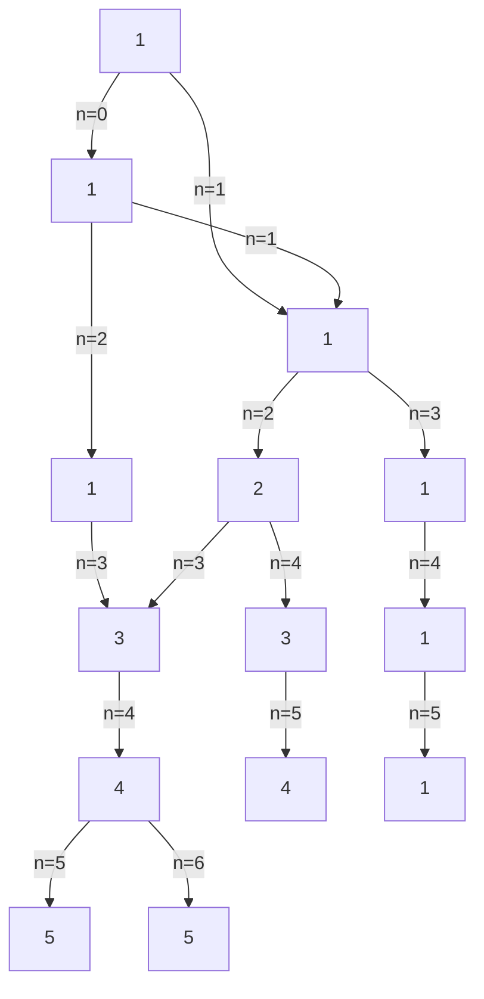
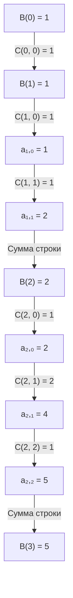

# Дискретная математика

## 1. Типы выборок k элементов из n

При выборе k элементов из множества из n элементов возможны различные типы выборок в зависимости от того, учитывается ли порядок элементов и допускаются ли повторения.

### Перестановки

Перестановка - это упорядоченное расположение всех n элементов множества (т.е. k = n).

Формула для вычисления числа перестановок из n элементов:

P(n) = n! = n × (n-1) × (n-2) × ... × 2 × 1

#### Перестановки с повторениями

Если имеется n элементов, среди которых есть повторяющиеся (n₁ элементов первого типа, n₂ элементов второго типа и т.д., причем n₁ + n₂ + ... + nₖ = n), то число различных перестановок вычисляется по формуле:

P(n₁, n₂, ..., nₖ) = n! / (n₁! × n₂! × ... × nₖ!)

### Размещения

Размещение - это упорядоченный набор из k элементов, выбранных из множества из n элементов (k ≤ n).

Формула для вычисления числа размещений из n элементов по k:

A(n, k) = n! / (n-k)! = n × (n-1) × ... × (n-k+1)

#### Размещения с повторениями

Если при составлении размещений допускаются повторения элементов, то число таких размещений:

Ā(n, k) = nᵏ

### Сочетания

Сочетание - это неупорядоченный набор из k элементов, выбранных из множества из n элементов (k ≤ n).

Формула для вычисления числа сочетаний из n элементов по k:

C(n, k) = n! / (k! × (n-k)!) = A(n, k) / k!

Cᵏₙ = C(n, k) = (n k) = n! / (k! × (n-k)!)

#### Сочетания с повторениями

Если при составлении сочетаний допускаются повторения элементов, то число таких сочетаний:

C̄(n, k) = C(n+k-1, k) = (n+k-1)! / (k! × (n-1)!)

### Сводная таблица типов выборок

| Тип выборки                   | Формула                           |
|-------------------------------|-----------------------------------|
| Перестановки                  | P(n) = n!                         |
| Перестановки с повторениями   | P(n₁, n₂, ...) = n! / (n₁! × n₂! × ...) |
| Размещения                    | A(n, k) = n! / (n-k)!             |
| Размещения с повторениями     | Ā(n, k) = nᵏ                      |
| Сочетания                     | C(n, k) = n! / (k! × (n-k)!)      |
| Сочетания с повторениями      | C̄(n, k) = C(n+k-1, k)             |

## 2. Бином Ньютона, следствия

### Бином Ньютона

Бином Ньютона - это формула для разложения бинома (x + y)ⁿ в многочлен:

(x + y)ⁿ = ∑ₖ₌₀ⁿ C(n, k) × xⁿ⁻ᵏ × yᵏ = C(n, 0) × xⁿ + C(n, 1) × xⁿ⁻¹ × y + ... + C(n, n) × yⁿ

где C(n, k) - биномиальные коэффициенты (числа сочетаний).

### Свойства биномиальных коэффициентов

1. C(n, 0) = C(n, n) = 1
2. C(n, k) = C(n, n-k)
3. C(n+1, k) = C(n, k-1) + C(n, k)
4. ∑ₖ₌₀ⁿ C(n, k) = 2ⁿ
5. ∑ₖ₌₀ⁿ (-1)ᵏ × C(n, k) = 0
6. ∑ₖ₌₀ⁿ k × C(n, k) = n × 2ⁿ⁻¹

### Треугольник Паскаля

Треугольник Паскаля - это треугольное расположение биномиальных коэффициентов C(n, k), где n - номер строки (начиная с 0), k - номер элемента в строке (начиная с 0).

Каждое число в треугольнике равно сумме двух чисел, расположенных над ним:
C(n+1, k) = C(n, k-1) + C(n, k)

### Полиномиальная теорема

Полиномиальная теорема является обобщением бинома Ньютона и позволяет разложить выражение (x₁ + x₂ + ... + xₘ)ⁿ:

(x₁ + x₂ + ... + xₘ)ⁿ = ∑ₖ₁₊ₖ₂₊...₊ₖₘ₌ₙ (n! / (k₁! × k₂! × ... × kₘ!)) × x₁ᵏ¹ × x₂ᵏ² × ... × xₘᵏᵐ

где сумма берется по всем наборам неотрицательных целых чисел (k₁, k₂, ..., kₘ), удовлетворяющих условию k₁ + k₂ + ... + kₘ = n.

Коэффициент при x₁ᵏ¹ × x₂ᵏ² × ... × xₘᵏᵐ называется полиномиальным коэффициентом и обозначается:

C(n; k₁, k₂, ..., kₘ) = n! / (k₁! × k₂! × ... × kₘ!)

## 3. Разбиение множества

Разбиением множества A называется такое семейство непустых подмножеств A₁, A₂, ..., Aₖ множества A, что:
1. A₁ ∪ A₂ ∪ ... ∪ Aₖ = A (объединение всех подмножеств дает исходное множество)
2. Aᵢ ∩ Aⱼ = ∅ для всех i ≠ j (подмножества попарно не пересекаются)

### Числа Стирлинга II рода

Число Стирлинга второго рода S(n, k) определяет количество способов разбить множество из n элементов на k непустых непересекающихся подмножеств.

Рекуррентное соотношение для вычисления чисел Стирлинга II рода:

S(n, k) = k × S(n-1, k) + S(n-1, k-1), n > 0, k > 0

с граничными условиями:
- S(n, 0) = 0 для n > 0
- S(0, 0) = 1
- S(n, k) = 0 для k > n

### Числа Белла

Число Белла B(n) определяет общее количество различных разбиений множества из n элементов (на любое количество подмножеств).

Связь с числами Стирлинга II рода:

B(n) = ∑ₖ₌₁ⁿ S(n, k)

### Рекуррентное соотношение для чисел Белла

Числа Белла можно вычислить по следующему рекуррентному соотношению:

B(n+1) = ∑ₖ₌₀ⁿ C(n, k) × B(k)

Также для чисел Белла существует треугольная схема вычисления:

где aᵢ,ⱼ вычисляются по формуле:
- aᵢ,₀ = B(i)
- aᵢ,ⱼ = aᵢ,ⱼ₋₁ + aᵢ₋₁,ⱼ₋₁

## 4. Формула включений и исключений

### В терминах множеств

Формула включений и исключений позволяет вычислить мощность объединения нескольких конечных множеств.

Для двух множеств:
|A ∪ B| = |A| + |B| - |A ∩ B|

Для трех множеств:
|A ∪ B ∪ C| = |A| + |B| + |C| - |A ∩ B| - |A ∩ C| - |B ∩ C| + |A ∩ B ∩ C|

Для n множеств:
|A₁ ∪ A₂ ∪ ... ∪ Aₙ| = ∑ᵢ |Aᵢ| - ∑ᵢ<ⱼ |Aᵢ ∩ Aⱼ| + ∑ᵢ<ⱼ<ₖ |Aᵢ ∩ Aⱼ ∩ Aₖ| - ... + (-1)ⁿ⁺¹ |A₁ ∩ A₂ ∩ ... ∩ Aₙ|

или в более компактной форме:
|∪ᵢ₌₁ⁿ Aᵢ| = ∑ₖ₌₁ⁿ (-1)ᵏ⁺¹ ∑₁≤ᵢ₁<ᵢ₂<...<ᵢₖ≤ₙ |Aᵢ₁ ∩ Aᵢ₂ ∩ ... ∩ Aᵢₖ|

### В терминах свойств

Если U - универсальное множество, а Aᵢ - множество элементов, обладающих свойством i, то формула включений и исключений позволяет найти количество элементов, обладающих хотя бы одним из n свойств:

|A₁ ∪ A₂ ∪ ... ∪ Aₙ| = ∑ₖ₌₁ⁿ (-1)ᵏ⁺¹ ∑₁≤ᵢ₁<ᵢ₂<...<ᵢₖ≤ₙ N(ᵢ₁, ᵢ₂, ..., ᵢₖ)

где N(ᵢ₁, ᵢ₂, ..., ᵢₖ) - количество элементов, обладающих свойствами i₁, i₂, ..., iₖ одновременно.

### Формула для вычисления числа элементов, обладающих ровно k свойствами

Пусть N₌ₖ - количество элементов, обладающих ровно k свойствами из n. Тогда:

N₌ₖ = ∑ᵢ₌ₖⁿ (-1)ⁱ⁻ᵏ × C(i, k) × Nᵢ

где Nᵢ - количество элементов, обладающих по крайней мере i свойствами.

Альтернативно, можно выразить через количество элементов, обладающих ровно i свойствами:

N₌ₖ = ∑ⱼ₌₀ⁿ⁻ᵏ (-1)ʲ × C(n-k, j) × N(k+j)

где N(i) - количество элементов, обладающих всеми i указанными свойствами.

### Формула для вычисления числа элементов, обладающих не менее чем k свойствами

Пусть N≥ₖ - количество элементов, обладающих не менее чем k свойствами из n. Тогда:

N≥ₖ = ∑ᵢ₌ₖⁿ N₌ᵢ = ∑ᵢ₌ₖⁿ ∑ⱼ₌₀ⁿ⁻ᵏ (-1)ʲ × C(n-i, j) × N(i+j)

Используя формулу включений и исключений:

N≥ₖ = ∑ᵢ₌ₖⁿ (-1)ⁱ⁻ᵏ × C(i-1, k-1) × N(i)

где N(i) - количество элементов, обладающих всеми i указанными свойствами.

## 5. Производящие функции

Производящая функция для последовательности {aₙ}ₙ₌₀^∞ - это формальный степенной ряд:

G(x) = ∑ₙ₌₀^∞ aₙ × xⁿ = a₀ + a₁x + a₂x² + a₃x³ + ...

### Свойства производящих функций

#### Сложение

Если G₁(x) = ∑ₙ₌₀^∞ aₙ × xⁿ и G₂(x) = ∑ₙ₌₀^∞ bₙ × xⁿ, то:

G₁(x) + G₂(x) = ∑ₙ₌₀^∞ (aₙ + bₙ) × xⁿ

#### Умножение

Если G₁(x) = ∑ₙ₌₀^∞ aₙ × xⁿ и G₂(x) = ∑ₙ₌₀^∞ bₙ × xⁿ, то:

G₁(x) × G₂(x) = ∑ₙ₌₀^∞ cₙ × xⁿ, где cₙ = ∑ₖ₌₀ⁿ aₖ × bₙ₋ₖ

Это соответствует свертке последовательностей {aₙ} и {bₙ}.

#### Дифференцирование

Если G(x) = ∑ₙ₌₀^∞ aₙ × xⁿ, то:

G'(x) = ∑ₙ₌₁^∞ n × aₙ × xⁿ⁻¹ = ∑ₙ₌₀^∞ (n+1) × aₙ₊₁ × xⁿ

Это позволяет извлечь коэффициенты с весами n.

#### Интегрирование

Если G(x) = ∑ₙ₌₀^∞ aₙ × xⁿ, то:

∫G(x)dx = C + ∑ₙ₌₀^∞ aₙ × xⁿ⁺¹/(n+1) = C + ∑ₙ₌₁^∞ aₙ₋₁ × xⁿ/n

где C - константа интегрирования.

### Примеры применения производящих функций

#### Последовательность Фибоначчи

Для последовательности Фибоначчи {Fₙ}ₙ₌₀^∞, где F₀ = 0, F₁ = 1, Fₙ₊₂ = Fₙ₊₁ + Fₙ, производящая функция:

G(x) = x / (1 - x - x²)

#### Биномиальные коэффициенты

Производящая функция для биномиальных коэффициентов C(n, k) при фиксированном n:

G(x) = (1 + x)ⁿ = ∑ₖ₌₀ⁿ C(n, k) × xᵏ

## 6. Однородные и неоднородные линейные рекуррентные соотношения

### Линейные рекуррентные соотношения

Линейное рекуррентное соотношение порядка k - это соотношение вида:

aₙ = c₁aₙ₋₁ + c₂aₙ₋₂ + ... + cₖaₙ₋ₖ + f(n)

где c₁, c₂, ..., cₖ - константы, cₖ ≠ 0, а f(n) - заданная функция.

### Однородные линейные рекуррентные соотношения

Если f(n) = 0, то рекуррентное соотношение называется однородным:

aₙ = c₁aₙ₋₁ + c₂aₙ₋₂ + ... + cₖaₙ₋ₖ

### Характеристическое уравнение

Для решения однородного линейного рекуррентного соотношения порядка k используется характеристическое уравнение:

rᵏ - c₁rᵏ⁻¹ - c₂rᵏ⁻² - ... - cₖ = 0

### Теорема об общем виде решения однородного линейного рекуррентного соотношения порядка k

Пусть r₁, r₂, ..., rₛ - различные корни характеристического уравнения с кратностями m₁, m₂, ..., mₛ соответственно (m₁ + m₂ + ... + mₛ = k).

Тогда общее решение однородного линейного рекуррентного соотношения порядка k имеет вид:

aₙ = ∑ᵢ₌₁ˢ (α₁ᵢ + α₂ᵢn + α₃ᵢn² + ... + αₘᵢᵢnᵐⁱ⁻¹) × rᵢⁿ

где α₁ᵢ, α₂ᵢ, ..., αₘᵢᵢ - произвольные константы, определяемые из начальных условий.

Частные случаи:
1. Если все корни r₁, r₂, ..., rₖ различны (все m_i = 1), то общее решение:
   aₙ = α₁r₁ⁿ + α₂r₂ⁿ + ... + αₖrₖⁿ

2. Если есть кратные корни, то для корня rᵢ кратности mᵢ соответствующая часть решения:
   (α₁ᵢ + α₂ᵢn + α₃ᵢn² + ... + αₘᵢᵢnᵐⁱ⁻¹) × rᵢⁿ

### Неоднородные линейные рекуррентные соотношения

Для неоднородного линейного рекуррентного соотношения:

aₙ = c₁aₙ₋₁ + c₂aₙ₋₂ + ... + cₖaₙ₋ₖ + f(n)

общее решение представляется в виде:

aₙ = aₙ' + aₙ''

где aₙ' - общее решение соответствующего однородного уравнения, а aₙ'' - частное решение неоднородного уравнения.

Для нахождения частного решения используются методы:
1. Метод неопределенных коэффициентов (если f(n) - многочлен, экспонента или их произведение)
2. Метод вариации произвольных постоянных
3. Использование производящих функций
