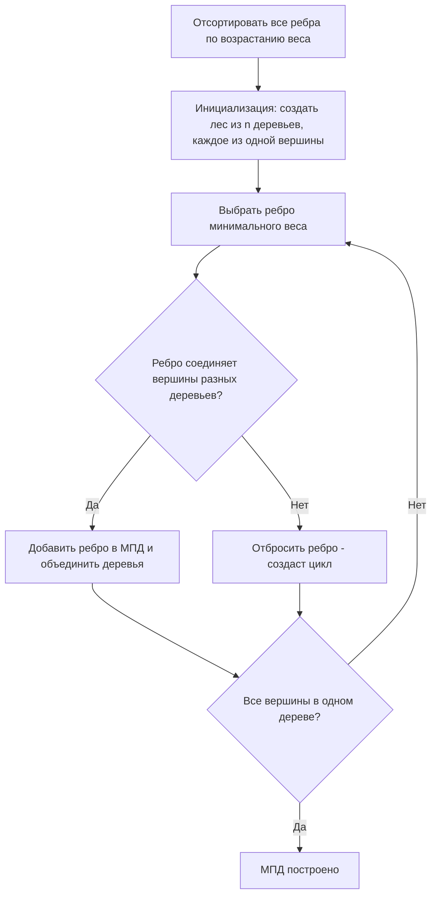
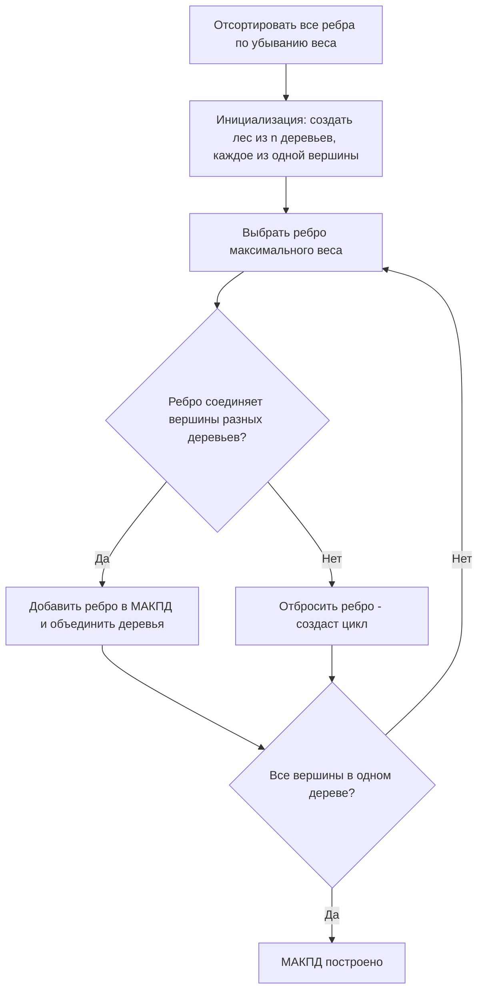
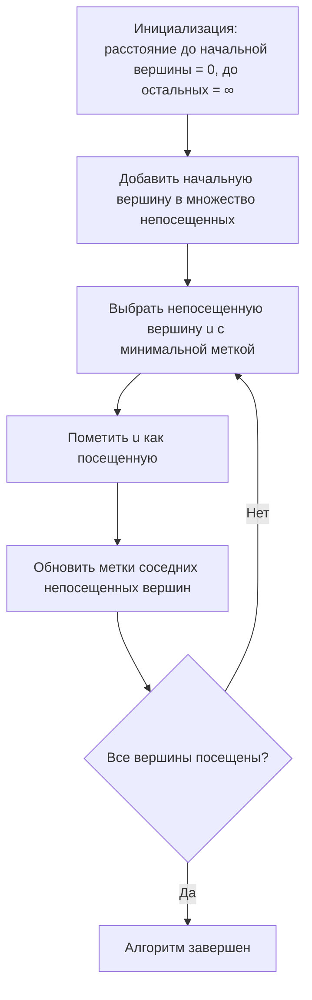
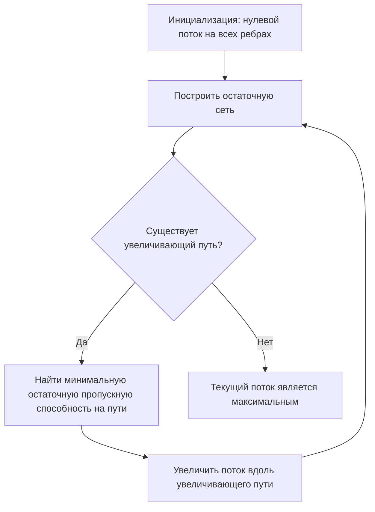
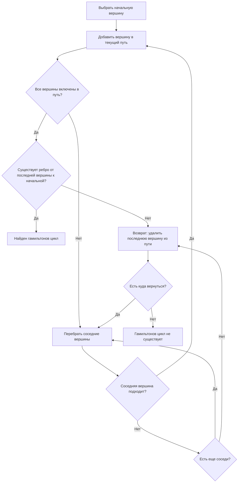
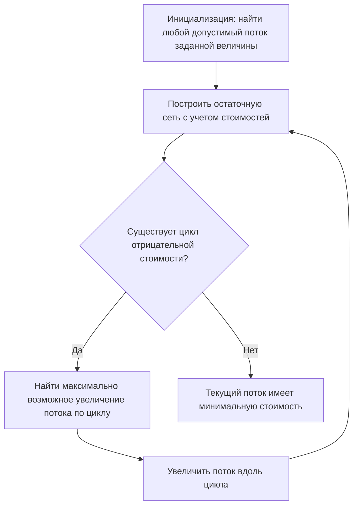

# Теория конечных графов

## 1. Построение минимального покрывающего дерева по алгоритму Краскала

Минимальное покрывающее (остовное) дерево (МПД) для взвешенного графа — это ациклический связный подграф, содержащий все вершины исходного графа и имеющий минимальную возможную суммарную стоимость ребер.

### Основные понятия

- **Связный граф** — граф, в котором существует путь между любыми двумя вершинами.
- **Дерево** — связный ациклический граф.
- **Покрывающее дерево** — подграф графа G, являющийся деревом и содержащий все вершины G.

### Алгоритм Краскала для построения МПД



### Алгоритм по шагам

1. **Инициализация**:
   - Отсортировать все ребра графа G = (V, E) по неубыванию веса.
   - Создать лес F из |V| деревьев, каждое состоящее из одной вершины.
   - Создать пустое множество A, в котором будут храниться ребра МПД.

2. **Построение**:
   - Пока в F больше одного дерева и есть неиспользованные ребра:
     - Выбрать ребро (u, v) с минимальным весом из оставшихся.
     - Если u и v принадлежат разным деревьям в F, то:
       - Добавить ребро (u, v) в множество A.
       - Объединить деревья, содержащие u и v, в одно дерево в F.
     - Иначе отбросить ребро, так как оно образует цикл.

3. **Завершение**:
   - Когда в F останется только одно дерево или все ребра будут проверены, алгоритм завершается.
   - Результирующее множество ребер A образует минимальное покрывающее дерево.

### Реализация с использованием системы непересекающихся множеств

Для эффективной реализации алгоритма Краскала используется структура данных "система непересекающихся множеств" (Union-Find) с операциями:
- **MakeSet(x)** — создание нового множества, содержащего только элемент x.
- **Find(x)** — определение, к какому множеству принадлежит элемент x.
- **Union(x, y)** — объединение множеств, содержащих элементы x и y.

## 2. Построение максимального покрывающего дерева по алгоритму Краскала

Максимальное покрывающее дерево (МАКПД) — это покрывающее дерево с максимально возможной суммарной стоимостью ребер.

### Алгоритм Краскала для построения МАКПД

Алгоритм Краскала для построения максимального покрывающего дерева аналогичен алгоритму для минимального дерева, с одним ключевым отличием: ребра сортируются по убыванию веса, а не по возрастанию.



### Алгоритм по шагам

1. **Инициализация**:
   - Отсортировать все ребра графа G = (V, E) по неубыванию веса (в порядке убывания).
   - Создать лес F из |V| деревьев, каждое состоящее из одной вершины.
   - Создать пустое множество A, в котором будут храниться ребра МАКПД.

2. **Построение**:
   - Пока в F больше одного дерева и есть неиспользованные ребра:
     - Выбрать ребро (u, v) с максимальным весом из оставшихся.
     - Если u и v принадлежат разным деревьям в F, то:
       - Добавить ребро (u, v) в множество A.
       - Объединить деревья, содержащие u и v, в одно дерево в F.
     - Иначе отбросить ребро, так как оно образует цикл.

3. **Завершение**:
   - Когда в F останется только одно дерево или все ребра будут проверены, алгоритм завершается.
   - Результирующее множество ребер A образует максимальное покрывающее дерево.

## 3. Поиск маршрута и наименьшей длины по алгоритму Дейкстры

Алгоритм Дейкстры решает задачу поиска кратчайших путей от одной вершины до всех остальных в графе с неотрицательными весами ребер.

### Основные понятия

- **Кратчайший путь** — путь между двумя вершинами с минимальной суммарной длиной.
- **Метка вершины** — текущая оценка длины кратчайшего пути от начальной вершины.
- **Предшественник вершины** — вершина, из которой осуществляется оптимальный вход в текущую.

### Алгоритм Дейкстры



### Алгоритм по шагам

1. **Инициализация**:
   - Установить метку начальной вершины s равной 0: dist[s] = 0.
   - Для всех остальных вершин v установить метки равными бесконечности: dist[v] = ∞.
   - Создать множество непосещенных вершин, содержащее все вершины графа.
   - Инициализировать массив предшественников pred[v] = null для всех вершин.

2. **Основной цикл**:
   - Пока множество непосещенных вершин не пусто:
     - Выбрать из непосещенных вершину u с минимальной меткой dist[u].
     - Пометить u как посещенную (удалить из множества непосещенных).
     - Для каждой непосещенной соседней вершины v вершины u:
       - Рассчитать новое расстояние через u: newDist = dist[u] + weight(u, v).
       - Если newDist < dist[v], то обновить dist[v] = newDist и pred[v] = u.

3. **Восстановление путей**:
   - После завершения алгоритма для каждой вершины v значение dist[v] содержит длину кратчайшего пути от s до v.
   - Путь можно восстановить, следуя от v к s через предшественников в массиве pred.

### Ограничения

- Алгоритм Дейкстры не работает корректно с графами, содержащими ребра отрицательного веса.
- Для графов с отрицательными весами, но без отрицательных циклов, следует использовать алгоритм Беллмана-Форда.

## 4. Особенности i-й строки и i-столбца для Алгоритма Уоршалла-Флойда

Алгоритм Уоршалла-Флойда используется для нахождения длин кратчайших путей между всеми парами вершин взвешенного графа. Особое значение в алгоритме имеют i-я строка и i-й столбец матрицы расстояний на каждой итерации.

### Особенности i-й строки и i-столбца

Рассмотрим матрицу расстояний D, где D[u][v] представляет длину кратчайшего пути от вершины u до вершины v.

На итерации k алгоритма Уоршалла-Флойда:
- **i-я строка** содержит длины кратчайших путей от вершины i до всех вершин, с использованием вершин {0, 1, ..., k-1} в качестве промежуточных.
- **i-й столбец** содержит длины кратчайших путей от всех вершин до вершины i, с использованием вершин {0, 1, ..., k-1} в качестве промежуточных.

### Доказательство особенностей

На итерации k алгоритм Уоршалла-Флойда обновляет элементы матрицы расстояний по формуле:
D[i][j] = min(D[i][j], D[i][k] + D[k][j])

Если рассмотреть i-ю строку (фиксированное i, переменное j), то элементы D[i][j] обновляются на основе элемента D[i][k], который принадлежит i-й строке, и элементов D[k][j], которые принадлежат k-й строке.

Аналогично для i-го столбца (фиксированное j = i, переменное s), элементы D[s][i] обновляются на основе элементов D[s][k] из k-го столбца и элемента D[k][i], который принадлежит i-му столбцу.

Таким образом, на итерации k значения в i-й строке и i-м столбце зависят от:
1. Их предыдущих значений на итерации k-1.
2. Значений в k-й строке и k-м столбце на итерации k-1.

### Практическое значение особенностей

Эта особенность алгоритма Уоршалла-Флойда имеет важное практическое значение:
- Она позволяет оптимизировать алгоритм для параллельных вычислений, поскольку обновления в разных строках и столбцах могут выполняться независимо.
- Понимание этой особенности помогает в доказательстве корректности алгоритма и в анализе его сложности.

## 5. Особенности i-й строки и i-столбца для Алгоритма поиска транзитивного замыкания

Алгоритм поиска транзитивного замыкания определяет для каждой пары вершин (i, j) графа существует ли путь из i в j. Как и в алгоритме Уоршалла-Флойда, i-я строка и i-й столбец имеют специфические особенности.

### Определение транзитивного замыкания

Транзитивное замыкание графа G — это граф G', такой что между вершинами i и j существует ребро в G' тогда и только тогда, когда в G существует путь из i в j.

### Алгоритм поиска транзитивного замыкания

Алгоритм использует булеву матрицу смежности R, где R[i][j] = true, если существует прямое ребро или путь из i в j, и false в противном случае.

```mermaid
graph TD
    A[Инициализация: R = матрица смежности исходного графа] --> B[Для каждой вершины k от 0 до n-1]
    B --> C[Для каждой вершины i от 0 до n-1]
    C --> D[Для каждой вершины j от 0 до n-1]
    D --> E[R[i][j] = R[i][j] или R[i][k] и R[k][j]]
    E --> F{Все j обработаны?}
    F -- Да --> G{Все i обработаны?}
    F -- Нет --> D
    G -- Да --> H{Все k обработаны?}
    G -- Нет --> C
    H -- Да --> I[Транзитивное замыкание построено]
    H -- Нет --> B
```

### Особенности i-й строки и i-столбца

В контексте алгоритма поиска транзитивного замыкания:

1. **i-я строка** матрицы R на итерации k содержит информацию о том, в какие вершины можно попасть из вершины i, используя пути, проходящие через вершины с номерами не больше k.

2. **i-й столбец** матрицы R на итерации k содержит информацию о том, из каких вершин можно попасть в вершину i, используя пути, проходящие через вершины с номерами не больше k.

### Доказательство особенностей

На итерации k алгоритм обновляет элементы матрицы R по формуле:
R[i][j] = R[i][j] ∨ (R[i][k] ∧ R[k][j])

Для i-й строки (фиксированное i, переменное j):
- R[i][j] обновляется на основе элемента R[i][k] (принадлежит i-й строке) и элементов R[k][j] (принадлежат k-й строке).

Для i-го столбца (фиксированное j = i, переменное s):
- R[s][i] обновляется на основе элементов R[s][k] (принадлежат k-му столбцу) и элемента R[k][i] (принадлежит i-му столбцу).

Таким образом, на итерации k значения в i-й строке и i-м столбце зависят от:
1. Их предыдущих значений на итерации k-1.
2. Значений в k-й строке и k-м столбце на итерации k-1.

## 6. Поиск максимального потока в графе

Задача о максимальном потоке в сети состоит в нахождении потока наибольшей величины из источника s в сток t при соблюдении ограничений на пропускную способность ребер.

### Основные понятия

- **Поток** — функция f: E → R, приписывающая каждому ребру (u, v) величину потока f(u, v), удовлетворяющая следующим условиям:
  - **Ограничение пропускной способности**: 0 ≤ f(u, v) ≤ c(u, v), где c(u, v) — пропускная способность ребра.
  - **Сохранение потока**: для каждой вершины v, кроме источника s и стока t, сумма входящего потока равна сумме исходящего.

- **Остаточная сеть** — граф, показывающий возможности изменения потока. Для каждого ребра (u, v) с потоком f(u, v) в остаточной сети есть:
  - Прямое ребро (u, v) с остаточной пропускной способностью c_f(u, v) = c(u, v) - f(u, v).
  - Обратное ребро (v, u) с остаточной пропускной способностью c_f(v, u) = f(u, v).

- **Увеличивающий путь** — путь от источника s к стоку t в остаточной сети.

### Алгоритм поиска максимального потока (алгоритм Форда-Фалкерсона)



### Алгоритм по шагам

1. **Инициализация**:
   - Установить нулевой поток f(u, v) = 0 для всех ребер (u, v).
   - Построить начальную остаточную сеть G_f.

2. **Основной цикл**:
   - Пока существует увеличивающий путь p от s до t в остаточной сети G_f:
     - Найти минимальную остаточную пропускную способность c_f(p) вдоль пути p.
     - Для каждого ребра (u, v) на пути p:
       - Если (u, v) — исходное ребро сети, увеличить поток: f(u, v) += c_f(p).
       - Если (u, v) — обратное ребро, уменьшить поток на соответствующем исходном ребре: f(v, u) -= c_f(p).
     - Обновить остаточную сеть G_f.

3. **Завершение**:
   - Когда больше нет увеличивающих путей, текущий поток является максимальным.

### Реализации алгоритма Форда-Фалкерсона

1. **Базовый алгоритм Форда-Фалкерсона**:
   - Поиск увеличивающего пути можно выполнять любым алгоритмом поиска пути (например, DFS).
   - Не гарантирует полиномиальное время работы для нецелых пропускных способностей.

2. **Алгоритм Эдмондса-Карпа**:
   - Использует BFS для поиска увеличивающего пути (всегда находит кратчайший путь).
   - Время работы O(VE²), где V — число вершин, E — число ребер.

3. **Алгоритм Диница**:
   - Использует концепцию уровневых графов для ускорения поиска увеличивающих путей.
   - Время работы O(V²E).

## 7. Поиск гамильтонова цикла в орграфе

Гамильтонов цикл — это цикл в графе, проходящий через каждую вершину ровно один раз и возвращающийся в исходную вершину. Задача нахождения гамильтонова цикла в орграфе является NP-полной.

### Основные понятия

- **Гамильтонов цикл** — цикл, проходящий через каждую вершину графа ровно один раз.
- **Гамильтонов путь** — путь, проходящий через каждую вершину графа ровно один раз.
- **Орграф (ориентированный граф)** — граф, в котором ребра имеют направление.

### Алгоритм поиска гамильтонова цикла с упрощением

Для поиска гамильтонова цикла в орграфе можно использовать алгоритм с возвратом (backtracking) с применением эвристик для ускорения.



### Алгоритм по шагам с упрощением

1. **Инициализация**:
   - Выбрать произвольную начальную вершину v₀.
   - Инициализировать путь P = [v₀].
   - Отметить v₀ как посещенную.

2. **Рекурсивный поиск**:
   - Функция HamiltonianCycle(P, visited):
     - Если |P| = |V| (все вершины включены в путь):
       - Проверить, существует ли ребро от последней вершины пути к начальной.
       - Если да, то P + v₀ образует гамильтонов цикл.
     - Иначе:
       - Для каждой непосещенной вершины v, смежной с последней вершиной пути:
         - Добавить v в путь P.
         - Отметить v как посещенную.
         - Рекурсивно вызвать HamiltonianCycle(P, visited).
         - Если найден гамильтонов цикл, вернуть true.
         - Иначе удалить v из пути и отметить как непосещенную (backtracking).
       - Если после перебора всех смежных вершин цикл не найден, вернуть false.

3. **Упрощения и эвристики**:
   - **Проверка локальных условий**: Если вершина имеет меньше двух ребер, гамильтонов цикл не существует.
   - **Проверка связности**: Если граф не является сильно связным, гамильтонов цикл не существует.
   - **Упорядочивание вершин**: Сначала рассматривать вершины с меньшей степенью.
   - **Проверка на отсечение**: Если добавление вершины v в путь отрезает некоторые непосещенные вершины от оставшихся, то v не следует добавлять.

## 8. Поиск потока минимальной стоимости

Задача о потоке минимальной стоимости заключается в нахождении потока заданной величины из источника s в сток t с минимальной общей стоимостью пересылки потока по ребрам.

### Основные понятия

- **Стоимость ребра** — цена пересылки единицы потока по данному ребру.
- **Стоимость потока** — сумма произведений величин потока по каждому ребру на стоимость этого ребра.
- **Циркуляция** — поток, в котором для каждой вершины входящий поток равен исходящему.

### Алгоритм поиска потока минимальной стоимости



### Алгоритм по шагам

1. **Инициализация**:
   - Найти любой допустимый поток f величины F от источника s к стоку t (например, с помощью алгоритма Форда-Фалкерсона).
   - Построить остаточную сеть G_f, включая обратные ребра.
   - Для каждого ребра (u, v) определить его стоимость в остаточной сети:
     - Для исходного ребра: cost_f(u, v) = cost(u, v).
     - Для обратного ребра: cost_f(v, u) = -cost(u, v).

2. **Основной цикл**:
   - Пока в остаточной сети существует цикл отрицательной стоимости:
     - Найти цикл отрицательной стоимости (например, с помощью алгоритма Беллмана-Форда).
     - Определить максимально возможное увеличение потока δ вдоль цикла (минимальную остаточную пропускную способность на цикле).
     - Увеличить поток вдоль цикла на величину δ.
     - Обновить остаточную сеть G_f.

3. **Завершение**:
   - Когда больше нет циклов отрицательной стоимости, текущий поток имеет минимальную стоимость среди всех потоков величины F.

### Альтернативные алгоритмы

1. **Алгоритм последовательного кратчайшего пути**:
   - Начиная с нулевого потока, итеративно увеличивать поток по кратчайшему пути от s до t в остаточной сети, где длина ребра равна его стоимости.
   - Повторять, пока не будет достигнута требуемая величина потока.

2. **Алгоритм эффективного преобразования стоимостей**:
   - Использовать потенциалы вершин для преобразования стоимостей ребер, чтобы они стали неотрицательными.
   - Применять алгоритмы кратчайшего пути с неотрицательными весами (например, Дейкстры) для поиска увеличивающих путей.

3. **Симплекс-метод для сетей**:
   - Специализированная версия симплекс-метода линейного программирования для задачи о потоке минимальной стоимости.
   - Эффективно ищет и обновляет базисные решения, соответствующие допустимым потокам.
