# Вычислительные системы, сети и телекоммуникации

## 1. Коммутация в компьютерных сетях

Коммутация представляет собой процесс соединения абонентов сети для организации обмена данными между ними. В современных компьютерных сетях используются несколько основных методов коммутации, каждый из которых имеет свои особенности, преимущества и недостатки.

### Коммутация каналов

При коммутации каналов между абонентами устанавливается выделенное соединение на все время передачи данных. Выделенный канал не используется другими абонентами в течение всего сеанса связи, независимо от того, происходит ли в данный момент передача информации.

**Характеристики коммутации каналов:**
- Гарантированная пропускная способность на время соединения
- Минимальные задержки после установления соединения
- Отсутствие перегрузок на установленном маршруте
- Неэффективное использование пропускной способности при передаче пульсирующего трафика

**Примеры применения:** традиционная телефонная сеть (PSTN), сети ISDN

### Коммутация пакетов

При коммутации пакетов передаваемые данные разбиваются на сравнительно небольшие части (пакеты), которые содержат адресную информацию и могут передаваться независимо друг от друга по сети, возможно, по разным маршрутам.

**Характеристики коммутации пакетов:**
- Более эффективное использование пропускной способности сети
- Отсутствие блокировок при перегрузках отдельных каналов (возможность выбора альтернативных маршрутов)
- Возможны задержки и вариации задержек (джиттер)
- Необходимость в дополнительных механизмах для обеспечения требуемого качества обслуживания

**Виды коммутации пакетов:**
- **Дейтаграммная передача (connectionless)** — каждый пакет маршрутизируется независимо (примеры: IP)
- **Виртуальные соединения (connection-oriented)** — перед передачей данных устанавливается виртуальный канал (примеры: ATM, Frame Relay)

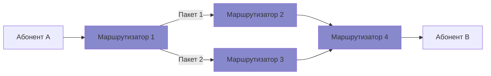

### Коммутация сообщений

При коммутации сообщений передаваемое сообщение целиком передается от одного узла коммутации к другому, причем каждый промежуточный узел принимает сообщение полностью, хранит его и затем передает дальше.

**Характеристики коммутации сообщений:**
- Позволяет преодолеть различия в скорости работы отправителя и получателя
- Требует значительных ресурсов памяти в коммутаторах
- Значительные задержки в передаче
- Неэффективность при передаче больших объемов данных

**Примеры применения:** электронная почта, передача файлов (в исторических компьютерных сетях)

### Коммутация ячеек

Коммутация ячеек является разновидностью коммутации пакетов, при которой данные разбиваются на ячейки фиксированного размера (обычно небольшого). Ячейки имеют упрощенный формат заголовка и обрабатываются аппаратно, что ускоряет процесс коммутации.

**Характеристики коммутации ячеек:**
- Более предсказуемые задержки по сравнению с коммутацией пакетов
- Эффективная реализация в аппаратном обеспечении
- Малые накладные расходы на обработку
- Некоторая избыточность при передаче небольших сообщений

**Пример применения:** технология ATM (Asynchronous Transfer Mode), где используются ячейки фиксированного размера в 53 байта (5 байт заголовок + 48 байт полезная нагрузка)

### Преимущества и недостатки различных типов коммутации

| Тип коммутации | Преимущества | Недостатки |
|----------------|--------------|------------|
| Коммутация каналов | - Гарантированная пропускная способность - Постоянные задержки - Отсутствие перегрузок | - Неэффективное использование ресурсов - Время на установление соединения - Ограниченная масштабируемость |
| Коммутация пакетов | - Эффективное использование ресурсов - Устойчивость к сбоям - Гибкость и масштабируемость | - Изменяющиеся задержки - Возможны потери пакетов - Сложность обеспечения QoS |
| Коммутация сообщений | - Независимость от скорости работы конечных узлов - Возможность проверки целостности | - Большие требования к памяти - Значительные задержки - Сложность реализации |
| Коммутация ячеек | - Предсказуемые задержки - Эффективная аппаратная реализация - Поддержка различных типов трафика | - Дополнительные накладные расходы - Сложность интеграции с существующими сетями - Ограниченное распространение |

## 2. Стандартизация в телекоммуникациях

Стандартизация является ключевым аспектом развития телекоммуникационных технологий, обеспечивая совместимость оборудования и систем разных производителей, единообразие технических решений и возможность глобального взаимодействия.

### Основные организации по стандартизации

#### 1. Международный союз электросвязи (ITU — International Telecommunication Union)

ITU является специализированным агентством ООН по информационно-коммуникационным технологиям.

**Структура ITU:**
- **ITU-T** (Сектор стандартизации электросвязи) — разрабатывает международные стандарты в области телекоммуникаций, именуемые "Рекомендациями"
- **ITU-R** (Сектор радиосвязи) — управляет радиочастотным спектром и спутниковыми орбитами
- **ITU-D** (Сектор развития) — способствует расширению доступа к телекоммуникациям в развивающихся странах

**Особенности работы:**
- Формирование рекомендаций, а не обязательных стандартов
- Членство открыто для правительств и частных организаций
- Работа в исследовательских группах (Study Groups)
- Организация работы в четырехлетних циклах

#### 2. Институт инженеров электротехники и электроники (IEEE — Institute of Electrical and Electronics Engineers)

IEEE является профессиональной ассоциацией, которая разрабатывает широко используемые стандарты в области электроники и компьютерных наук.

**Значимые стандарты IEEE:**
- **IEEE 802** — семейство стандартов для локальных и городских сетей
  - IEEE 802.3 (Ethernet)
  - IEEE 802.11 (Wi-Fi)
  - IEEE 802.15 (Bluetooth, ZigBee)
  - IEEE 802.16 (WiMAX)

**Особенности работы:**
- Открытый процесс разработки стандартов
- Технически ориентированный подход
- Широкое участие специалистов из индустрии и академических кругов

#### 3. Интернет-инженерный совет (IETF — Internet Engineering Task Force)

IETF разрабатывает и поддерживает стандарты для Интернета, известные как RFC (Request for Comments).

**Основные области стандартизации:**
- Протоколы маршрутизации (BGP, OSPF)
- Протоколы транспортного уровня (TCP, UDP)
- Прикладные протоколы (HTTP, SMTP, DNS)
- Протоколы безопасности (TLS, IPsec)

**Особенности работы:**
- Неформальная структура без строгого членства
- Открытое участие
- Рабочие группы по конкретным темам
- Принцип "грубого консенсуса и работающего кода"

#### 4. Европейский институт телекоммуникационных стандартов (ETSI — European Telecommunications Standards Institute)

ETSI является европейской организацией, разрабатывающей стандарты для телекоммуникационной индустрии.

**Значимые стандарты ETSI:**
- GSM (Global System for Mobile Communications)
- UMTS (Universal Mobile Telecommunications System)
- LTE (Long-Term Evolution)
- DECT (Digital Enhanced Cordless Telecommunications)

**Особенности работы:**
- Региональная организация с глобальным влиянием
- Членство открыто для организаций из всех стран
- Технические комитеты по различным направлениям
- Взаимодействие с другими организациями стандартизации

#### 5. Международная организация по стандартизации (ISO — International Organization for Standardization)

ISO разрабатывает международные стандарты практически во всех областях, включая информационные технологии.

**Значимые стандарты ISO в области телекоммуникаций:**
- Модель OSI (Open Systems Interconnection)
- Стандарты качества (ISO 9000)
- Стандарты информационной безопасности (ISO 27000)

**Особенности работы:**
- Представительство через национальные органы стандартизации
- Консенсусный процесс принятия решений
- Периодический пересмотр стандартов

### Процесс стандартизации

Стандартизация в телекоммуникационной отрасли обычно проходит следующие этапы:

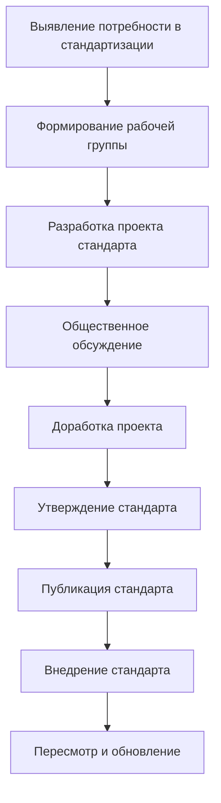

### Виды телекоммуникационных стандартов

1. **Функциональные стандарты** — определяют функции и возможности оборудования и систем
2. **Стандарты взаимодействия** — определяют интерфейсы между различными компонентами
3. **Стандарты производительности** — устанавливают метрики и требования к производительности
4. **Стандарты безопасности** — определяют требования к безопасности и конфиденциальности
5. **Стандарты управления** — определяют механизмы мониторинга и управления

### Значение стандартизации для развития телекоммуникаций

- Обеспечение глобальной совместимости и взаимодействия систем
- Снижение затрат на разработку и производство оборудования
- Создание конкурентного рынка с множеством поставщиков
- Защита инвестиций потребителей в технологии
- Ускорение внедрения новых технологий
- Обеспечение качества и безопасности телекоммуникационных услуг

## 3. Понятие о протоколе и межуровневом интерфейсе

### Протокол в телекоммуникациях

Протокол в телекоммуникациях — это набор правил и соглашений, определяющих формат и порядок обмена данными между устройствами в сети. Протоколы регламентируют все аспекты связи, включая установление соединения, передачу данных, обработку ошибок и завершение сеанса связи.

**Основные компоненты протокола:**

1. **Синтаксис** — определяет структуру и формат данных, включая:
   - Формат заголовков и полей сообщений
   - Размер и типы полей
   - Кодирование данных

2. **Семантика** — определяет смысловое значение элементов протокола:
   - Интерпретация полей заголовков
   - Значение управляющих сообщений
   - Типы операций и команд

3. **Тайминг** — определяет временные аспекты взаимодействия:
   - Последовательность сообщений
   - Скорость передачи
   - Тайм-ауты и повторные передачи

**Пример протокольного взаимодействия (TCP):**

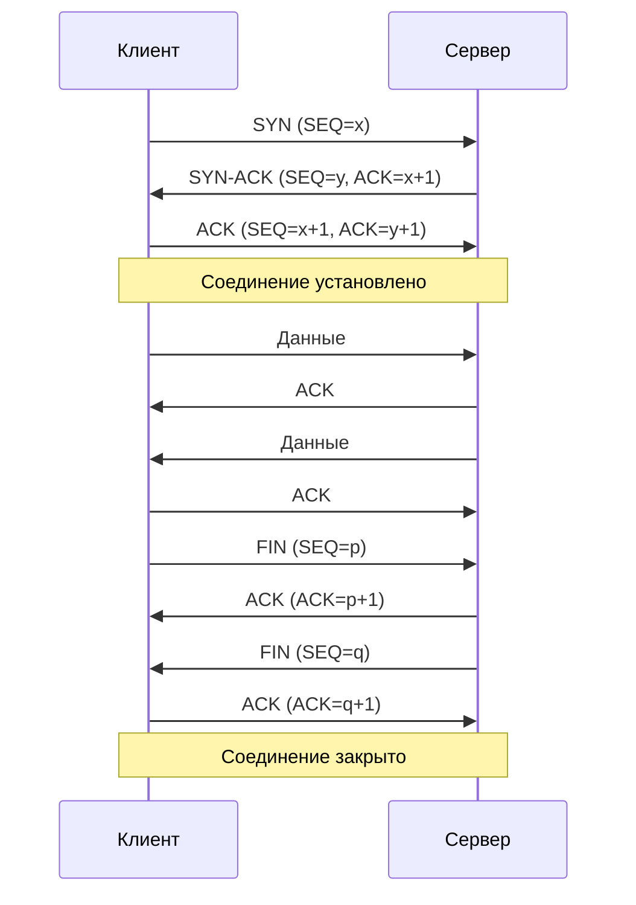

### Межуровневый интерфейс

Межуровневый интерфейс определяет способы взаимодействия между соседними уровнями сетевой архитектуры. Он обеспечивает передачу данных и управляющей информации между уровнями, позволяя каждому уровню выполнять свои функции независимо от реализации других уровней.

**Ключевые аспекты межуровневого интерфейса:**

1. **Примитивы сервиса** — набор операций или команд, с помощью которых верхний уровень запрашивает услуги нижнего уровня:
   - **Request** (запрос) — запрос на выполнение операции
   - **Indication** (уведомление) — оповещение о событии
   - **Response** (ответ) — ответ на уведомление
   - **Confirmation** (подтверждение) — подтверждение выполнения запроса

2. **Точки доступа к сервису (SAP — Service Access Point)** — логические точки, через которые верхний уровень получает доступ к услугам нижнего уровня.

3. **Протокольные блоки данных (PDU — Protocol Data Unit)** — форматы данных, которыми обмениваются одноранговые уровни разных устройств:
   - Данные верхнего уровня + заголовок = PDU данного уровня
   - PDU данного уровня = данные (SDU) для нижнего уровня

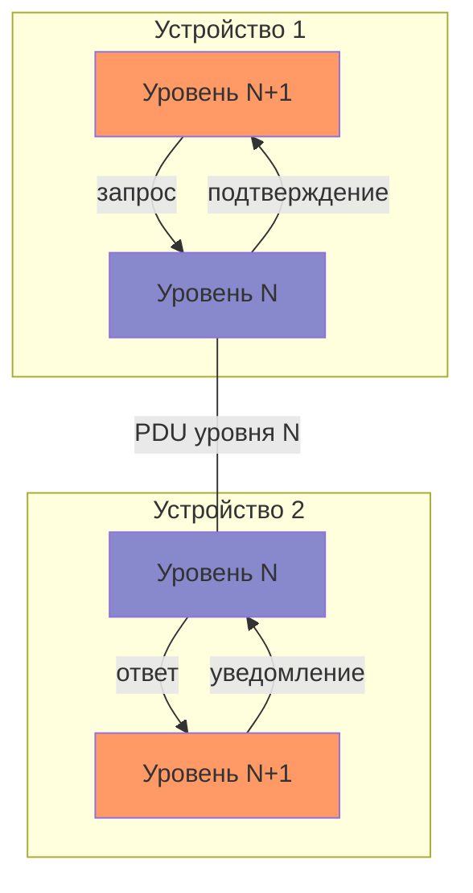

### Эталонная модель взаимодействия открытых систем ISO/OSI

Модель OSI (Open Systems Interconnection) — это концептуальная модель, разработанная Международной организацией по стандартизации (ISO) для стандартизации коммуникаций в компьютерных сетях. Она определяет семь уровней, каждый из которых выполняет определенные функции в процессе передачи данных.

**Уровни модели OSI:**

1. **Физический уровень (Physical Layer)** — передача битов по физическому каналу:
   - Электрические и механические характеристики интерфейса
   - Скорость передачи, кодирование сигналов
   - Топология соединений

2. **Канальный уровень (Data Link Layer)** — надежная передача кадров данных:
   - Обнаружение и коррекция ошибок
   - Управление доступом к среде (MAC)
   - Адресация на физическом уровне

3. **Сетевой уровень (Network Layer)** — маршрутизация пакетов через сеть:
   - Логическая адресация (IP-адреса)
   - Определение маршрутов
   - Фрагментация и сборка пакетов

4. **Транспортный уровень (Transport Layer)** — надежная передача данных между конечными точками:
   - Управление соединением
   - Контроль потока данных
   - Восстановление при ошибках

5. **Сеансовый уровень (Session Layer)** — управление сеансами связи:
   - Установление, поддержание и закрытие сеансов
   - Синхронизация обмена данными
   - Контрольные точки для восстановления

6. **Представительский уровень (Presentation Layer)** — представление и шифрование данных:
   - Преобразование форматов данных
   - Сжатие/распаковка данных
   - Шифрование/дешифрование

7. **Прикладной уровень (Application Layer)** — предоставление сетевых сервисов приложениям:
   - Интерфейс для пользовательских приложений
   - Протоколы прикладного уровня (HTTP, FTP, SMTP)
   - Идентификация взаимодействующих партнеров

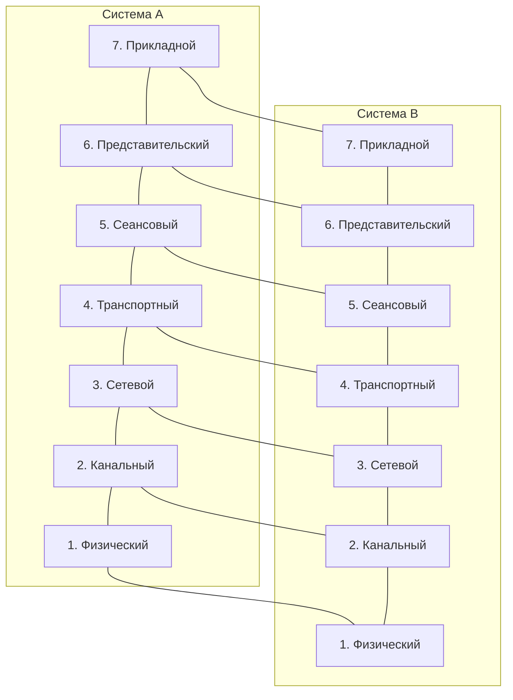

### Модель взаимодействия и стек протоколов TCP/IP

Стек протоколов TCP/IP — это набор протоколов, используемых в Интернете и большинстве современных компьютерных сетей. В отличие от модели OSI, которая является теоретической, TCP/IP представляет собой реальную реализацию сетевой архитектуры.

**Уровни стека TCP/IP:**

1. **Уровень сетевого доступа (Network Access Layer)** — соответствует физическому и канальному уровням модели OSI:
   - Ethernet, Wi-Fi, PPP, HDLC
   - Управление доступом к физической среде
   - Адресация на уровне канала (MAC-адреса)

2. **Интернет-уровень (Internet Layer)** — соответствует сетевому уровню модели OSI:
   - IP (Internet Protocol)
   - ICMP (Internet Control Message Protocol)
   - IGMP (Internet Group Management Protocol)
   - Маршрутизация пакетов

3. **Транспортный уровень (Transport Layer)** — соответствует транспортному уровню модели OSI:
   - TCP (Transmission Control Protocol) — надежная передача с установлением соединения
   - UDP (User Datagram Protocol) — ненадежная передача без установления соединения
   - SCTP (Stream Control Transmission Protocol) — сочетание надежности TCP и многопоточности

4. **Прикладной уровень (Application Layer)** — соответствует сеансовому, представительскому и прикладному уровням модели OSI:
   - HTTP/HTTPS (Web)
   - SMTP, POP3, IMAP (Email)
   - FTP, SFTP (передача файлов)
   - DNS (система доменных имен)
   - SSH, Telnet (удаленный доступ)

**Сравнение моделей OSI и TCP/IP:**

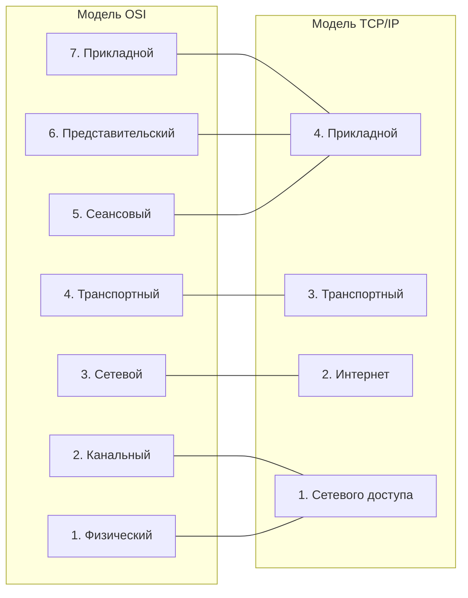

**Инкапсуляция данных в стеке TCP/IP:**

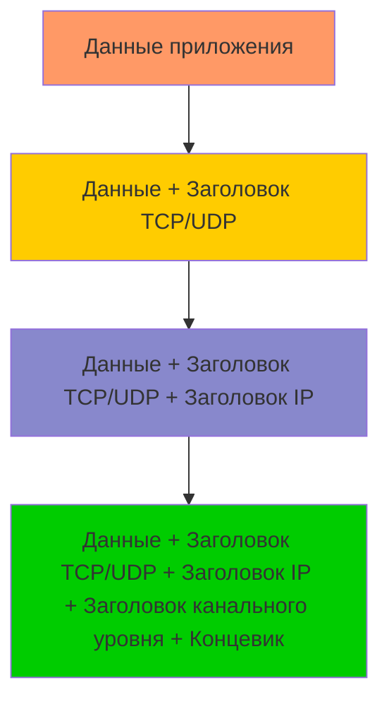

## 4. Адресация и маршрутизация в компьютерных сетях

### Адресация в компьютерных сетях

Адресация является ключевым механизмом, обеспечивающим идентификацию и достижимость устройств в сети. В современных компьютерных сетях используются различные схемы адресации на разных уровнях сетевой архитектуры.

#### Физическая (MAC) адресация

MAC-адрес (Media Access Control) — это уникальный идентификатор, присваиваемый сетевым интерфейсам для коммуникаций на канальном уровне сети.

**Характеристики MAC-адресов:**
- 48 бит (6 байт), обычно записывается как шесть пар шестнадцатеричных цифр, разделенных двоеточиями или дефисами (например, 00:1A:2B:3C:4D:5E)
- Первые 3 байта — OUI (Organizationally Unique Identifier), уникальный идентификатор производителя
- Последние 3 байта — уникальный номер устройства в рамках данного производителя
- Уникальный (в теории) в глобальном масштабе
- Обычно "прошивается" в устройство производителем

**Типы MAC-адресов:**
- **Unicast** — адрес конкретного сетевого интерфейса
- **Multicast** — адрес группы сетевых интерфейсов (первый бит первого байта = 1)
- **Broadcast** — адрес для отправки всем устройствам в сегменте (FF:FF:FF:FF:FF:FF)

#### Логическая (IP) адресация

IP-адрес (Internet Protocol) — это числовой идентификатор, присваиваемый устройствам в компьютерной сети, использующей протокол IP.

**IPv4:**
- 32-битный адрес, записываемый как четыре десятичных числа (от 0 до 255), разделенных точками (например, 192.168.0.1)
- Состоит из двух частей: сетевого префикса и идентификатора хоста
- Разделение на префикс сети и идентификатор хоста определяется маской подсети

**Классы IPv4-адресов:**
- **Класс A** (1-126.x.x.x) — маска подсети 255.0.0.0 (/8)
- **Класс B** (128-191.x.x.x) — маска подсети 255.255.0.0 (/16)
- **Класс C** (192-223.x.x.x) — маска подсети 255.255.255.0 (/24)
- **Класс D** (224-239.x.x.x) — для многоадресной рассылки
- **Класс E** (240-255.x.x.x) — зарезервирован для экспериментального использования

**Специальные адреса IPv4:**
- **Локальные адреса** (127.x.x.x) — для тестирования и диагностики
- **Частные адреса**:
  - 10.0.0.0 - 10.255.255.255 (10.0.0.0/8)
  - 172.16.0.0 - 172.31.255.255 (172.16.0.0/12)
  - 192.168.0.0 - 192.168.255.255 (192.168.0.0/16)

**IPv6:**
- 128-битный адрес, записываемый как восемь групп шестнадцатеричных цифр, разделенных двоеточиями (например, 2001:0db8:85a3:0000:0000:8a2e:0370:7334)
- Сокращенная нотация:
  - Ведущие нули в группе могут быть опущены (2001:db8:85a3:0:0:8a2e:370:7334)
  - Последовательность групп, содержащих только нули, может быть заменена двойным двоеточием (::) один раз в адресе (2001:db8:85a3::8a2e:370:7334)

**Типы адресов IPv6:**
- **Unicast** — адрес одного интерфейса
- **Multicast** — адрес группы интерфейсов (префикс ff00::/8)
- **Anycast** — адрес, присваиваемый нескольким интерфейсам, но пакет доставляется ближайшему

#### Разрешение адресов

**ARP (Address Resolution Protocol)** — протокол, используемый для определения MAC-адреса по известному IP-адресу в локальной сети:
- Устройство отправляет широковещательный ARP-запрос, содержащий IP-адрес
- Устройство с соответствующим IP-адресом отвечает своим MAC-адресом
- Соответствие сохраняется в ARP-кэше

**NDP (Neighbor Discovery Protocol)** — эквивалент ARP для IPv6, использующий ICMPv6 сообщения:
- Запрос соседа (Neighbor Solicitation)
- Объявление соседа (Neighbor Advertisement)
- Объявление маршрутизатора (Router Advertisement)
- Запрос маршрутизатора (Router Solicitation)

### Маршрутизация в компьютерных сетях

Маршрутизация — это процесс определения оптимального пути для передачи пакетов данных от источника к получателю через сеть или несколько сетей.

#### Основные концепции маршрутизации

**Таблица маршрутизации** — структура данных, содержащая информацию о доступных сетях и оптимальных путях к ним:
- Сетевой префикс (адрес назначения)
- Маска подсети
- Следующий узел (next hop)
- Интерфейс выхода
- Метрика (стоимость) маршрута
- Источник маршрута (статический, динамический, непосредственно подключенный)

**Принципы маршрутизации:**
- **Наиболее длинное совпадение префикса** (Longest Prefix Match) — при наличии нескольких подходящих маршрутов выбирается тот, у которого самая длинная маска подсети
- **Административная дистанция** — мера надежности источника маршрутной информации (например, в Cisco: непосредственно подключенная сеть — 0, статический маршрут — 1, EIGRP — 90, OSPF — 110, RIP — 120)
- **Метрика маршрута** — численное значение, отражающее "качество" маршрута (например, количество хопов, пропускная способность, задержка)

#### Протоколы маршрутизации

Протоколы маршрутизации автоматизируют процесс обмена маршрутной информацией между маршрутизаторами, позволяя им динамически обновлять свои таблицы маршрутизации.

**Классификация по области применения:**
- **IGP (Interior Gateway Protocol)** — протоколы для маршрутизации внутри автономной системы:
  - RIP (Routing Information Protocol)
  - OSPF (Open Shortest Path First)
  - IS-IS (Intermediate System to Intermediate System)
  - EIGRP (Enhanced Interior Gateway Routing Protocol)

- **EGP (Exterior Gateway Protocol)** — протоколы для маршрутизации между автономными системами:
  - BGP (Border Gateway Protocol)

**Классификация по принципу работы:**
- **Дистанционно-векторные протоколы** (Distance Vector):
  - Каждый маршрутизатор периодически отправляет своим соседям полную таблицу маршрутизации
  - Для выбора маршрута используется метрика, основанная на "расстоянии" (например, количество хопов)
  - Примеры: RIP, EIGRP (гибридный)
  - Проблемы: медленная сходимость, возможность образования петель маршрутизации

- **Протоколы состояния каналов** (Link State):
  - Каждый маршрутизатор строит топологическую карту сети
  - Маршрутизаторы обмениваются информацией о состоянии своих каналов
  - Для выбора маршрута используется алгоритм кратчайшего пути (например, алгоритм Дейкстры)
  - Примеры: OSPF, IS-IS
  - Преимущества: быстрая сходимость, отсутствие петель маршрутизации

- **Протоколы маршрутизации на основе политик** (Policy-Based):
  - Выбор маршрута осуществляется на основе административных правил и политик
  - Примеры: BGP
  - Используется для маршрутизации между автономными системами в Интернете

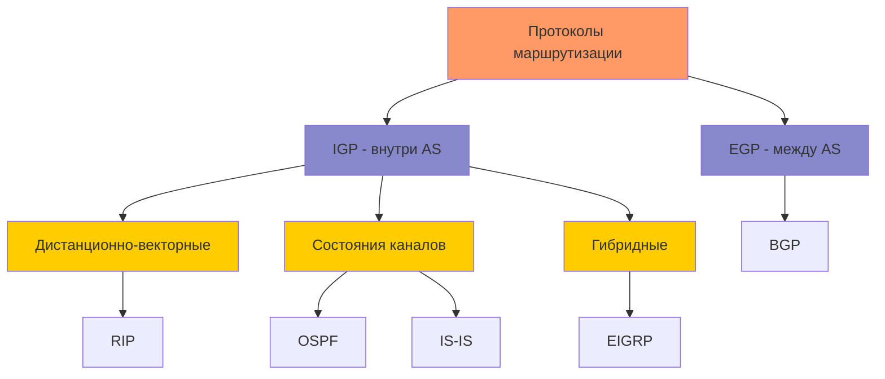

### Коммутация по меткам MPLS

MPLS (Multiprotocol Label Switching) — технология быстрой коммутации пакетов в многопротокольных сетях, основанная на использовании меток.

**Принципы работы MPLS:**
- Каждому пакету при входе в MPLS-сеть присваивается короткая фиксированная метка
- Маршрутизация пакетов внутри MPLS-сети осуществляется на основе меток, а не IP-адресов
- При передаче между маршрутизаторами метки могут заменяться, добавляться или удаляться
- Выходной маршрутизатор удаляет метку и передает пакет дальше на основе стандартной маршрутизации

**Компоненты MPLS-сети:**
- **LSR (Label Switch Router)** — маршрутизатор, поддерживающий MPLS
- **LSP (Label Switched Path)** — путь через MPLS-сеть, определяемый последовательностью меток
- **LDP (Label Distribution Protocol)** — протокол для распределения меток между LSR
- **FEC (Forwarding Equivalence Class)** — группа пакетов, которые обрабатываются одинаково при передаче

**Преимущества MPLS:**
- Повышение производительности коммутации (простая обработка фиксированных меток)
- Поддержка Quality of Service (QoS)
- Возможность организации виртуальных частных сетей (MPLS VPN)
- Поддержка Traffic Engineering — управления трафиком в сети
- Независимость от протоколов сетевого уровня (IP, IPX и т.д.)

## 5. Понятие о качестве обслуживания (QoS)

Качество обслуживания (Quality of Service, QoS) — это совокупность технологий, обеспечивающих предсказуемое и дифференцированное качество передачи данных для различных приложений и типов трафика в компьютерных сетях.

### Показатели QoS

Основные параметры, характеризующие качество обслуживания в сети:

1. **Пропускная способность (Bandwidth)** — максимальная скорость передачи данных:
   - Измеряется в битах в секунду (bps) или производных единицах (Kbps, Mbps, Gbps)
   - Разные приложения требуют разной пропускной способности (видео-конференции: ~1-4 Mbps, потоковое видео HD: ~5-8 Mbps, загрузка файлов: потенциально неограниченно)

2. **Задержка (Latency, Delay)** — время, требуемое для передачи пакета от источника к получателю:
   - Измеряется в миллисекундах (мс)
   - Составляющие задержки:
     - Задержка распространения (время прохождения сигнала по среде)
     - Задержка передачи (время помещения бита в среду)
     - Задержка обработки (время обработки пакета на узлах)
     - Задержка в очередях (время ожидания в буферах)
   - Критична для интерактивных приложений (голос: <150 мс, видео: <250 мс, игры: <100 мс)

3. **Джиттер (Jitter)** — вариация задержки при передаче последовательных пакетов:
   - Измеряется в миллисекундах (мс)
   - Высокий джиттер приводит к неравномерной передаче потоковых данных
   - Решается с помощью буферизации, но это увеличивает общую задержку
   - Критичен для медиа-приложений (голос, видео)

4. **Потеря пакетов (Packet Loss)** — доля пакетов, которые не достигли получателя:
   - Измеряется в процентах от общего числа отправленных пакетов
   - Причины потерь:
     - Перегрузка сети и переполнение буферов
     - Физические повреждения или помехи
     - Ошибки в работе оборудования
   - Допустимый уровень зависит от приложения (голос: <1%, видео: <0.5%, данные: зависит от протокола)

5. **Доступность (Availability)** — доля времени, в течение которого сеть функционирует нормально:
   - Измеряется в процентах или в терминах "девяток" (99.9%, 99.99% и т.д.)
   - Связана с надежностью сети и возможностью быстрого восстановления

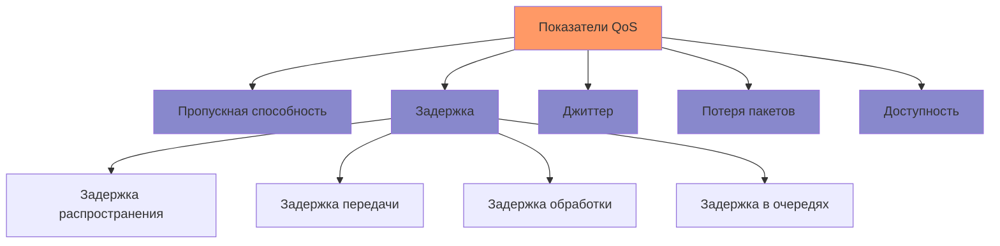

### Механизмы обеспечения QoS

Для обеспечения требуемого качества обслуживания в сетях применяются различные механизмы, воздействующие на разные аспекты передачи данных.

#### 1. Классификация и маркировка трафика

Процесс идентификации пакетов и присвоения им приоритетов для дальнейшей обработки.

**Методы классификации:**
- По портам или адресам (Layer 3-4)
- По типу приложения (Layer 7)
- По содержимому пакета (Deep Packet Inspection)

**Методы маркировки:**
- **ToS (Type of Service) / DSCP (Differentiated Services Code Point)** — поле в IP-заголовке (6 бит)
- **CoS (Class of Service)** — поле в Ethernet-заголовке 802.1Q (3 бита)
- **MPLS EXP** — поле в MPLS-метке (3 бита)

#### 2. Управление перегрузками и очередями

Механизмы, определяющие, какие пакеты будут обрабатываться в первую очередь, а какие могут быть отброшены при перегрузке.

**Алгоритмы организации очередей:**
- **FIFO (First-In-First-Out)** — обработка пакетов в порядке поступления
- **PQ (Priority Queuing)** — обработка пакетов в соответствии с приоритетом
- **WFQ (Weighted Fair Queuing)** — распределение ресурсов между потоками пропорционально их весам
- **CBWFQ (Class-Based Weighted Fair Queuing)** — применение WFQ к классам трафика
- **LLQ (Low Latency Queuing)** — сочетание CBWFQ с приоритетной очередью для чувствительного к задержкам трафика

**Механизмы управления перегрузками:**
- **Tail Drop** — отбрасывание пакетов при переполнении очереди
- **RED (Random Early Detection)** — вероятностное отбрасывание пакетов при приближении к переполнению
- **WRED (Weighted RED)** — применение различных профилей RED к разным классам трафика
- **ECN (Explicit Congestion Notification)** — уведомление отправителя о возможной перегрузке без отбрасывания пакетов

#### 3. Управление трафиком

Механизмы, регулирующие скорость и объем передаваемых данных.

**Traffic Policing:**
- Ограничение скорости трафика до заданного значения
- Отбрасывание пакетов, превышающих установленный предел
- Работает на входе или выходе интерфейса

**Traffic Shaping:**
- Сглаживание трафика, приведение его к заданному профилю
- Буферизация пакетов вместо их отбрасывания
- Обычно применяется на выходе интерфейса

**CAC (Call Admission Control):**
- Контроль установления новых соединений
- Отказ в установлении соединения, если нет достаточных ресурсов

#### 4. Резервирование ресурсов

Механизмы, гарантирующие выделение необходимых ресурсов для передачи данных.

**RSVP (Resource Reservation Protocol):**
- Сигнальный протокол для резервирования ресурсов вдоль пути
- Устанавливает сессии с требуемыми параметрами QoS
- Обеспечивает гарантированное качество обслуживания

**IntServ (Integrated Services):**
- Архитектура QoS, основанная на явном резервировании ресурсов
- Требует поддержки RSVP
- Обеспечивает строгие гарантии QoS, но имеет проблемы с масштабируемостью

**DiffServ (Differentiated Services):**
- Архитектура QoS, основанная на классификации и маркировке трафика
- Не требует поддержки сигнальных протоколов
- Обеспечивает относительные приоритеты без строгих гарантий
- Хорошо масштабируется на крупные сети

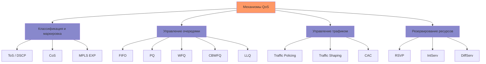

### Примеры внедрения QoS в различных сценариях

#### 1. Корпоративная сеть

**Приоритеты трафика:**
1. VoIP и видеоконференции (высший приоритет)
2. Бизнес-критичные приложения
3. Интерактивные приложения
4. Передача файлов и резервное копирование (низший приоритет)

**Типичные механизмы:**
- Классификация трафика по DSCP
- LLQ для голосового трафика
- CBWFQ для остальных классов
- Полисинг для ограничения некритичного трафика
- Шейпинг на WAN-соединениях

#### 2. Сеть интернет-провайдера

**Приоритеты трафика:**
1. Служебный трафик провайдера
2. Премиальные услуги (VoIP, видео)
3. Обычный пользовательский трафик
4. "Лучшее усилие" (Best Effort)

**Типичные механизмы:**
- DiffServ для масштабируемости
- Traffic Engineering с использованием MPLS
- Полисинг для соблюдения SLA
- WRED для управления перегрузками
- Hierarchical QoS для многоуровневых политик

#### 3. Беспроводные сети

**Приоритеты трафика:**
1. Голос и видео в реальном времени
2. Интерактивные данные
3. Фоновые приложения

**Типичные механизмы:**
- 802.11e / WMM (Wi-Fi Multimedia) для приоритизации
- Admission Control для ограничения числа соединений
- Адаптивное управление скоростью в зависимости от условий
- Специальные механизмы для мобильных сетей (QCI в LTE)

## 6. Эволюция стандартов сетей сотовой подвижной связи 3-го и 4-го поколений

Развитие сетей сотовой связи характеризуется постепенным переходом от систем, ориентированных преимущественно на голосовую связь, к универсальным мультисервисным сетям с высокоскоростной передачей данных и поддержкой различных типов приложений.

### Сети третьего поколения (3G)

Сети 3G были разработаны с целью обеспечения более высоких скоростей передачи данных, чем их предшественники, и поддержки мультимедийных услуг.

#### UMTS (Universal Mobile Telecommunications System)

UMTS — стандарт сотовой связи третьего поколения, разработанный 3GPP (3rd Generation Partnership Project) и являющийся европейским вариантом реализации концепции IMT-2000.

**Ключевые характеристики:**
- Использование технологии WCDMA (Wideband Code Division Multiple Access)
- Теоретическая скорость передачи данных до 2 Мбит/с (в первых версиях)
- Частотные диапазоны: преимущественно 2100 МГц, а также 850, 900, 1800, 1900 МГц
- Полоса частот: 5 МГц
- Архитектура сети, включающая:
  - Сеть радиодоступа UTRAN (UMTS Terrestrial Radio Access Network)
  - Базовые станции Node B и контроллеры RNC (Radio Network Controller)
  - Опорную сеть CN (Core Network), частично унаследованную от GSM/GPRS

**Эволюция UMTS:**

1. **Release 99 (1999)** — первая версия стандарта:
   - Скорость передачи данных до 384 кбит/с в условиях мобильности
   - До 2 Мбит/с в стационарных условиях
   - Интеграция с опорной сетью GSM/GPRS

2. **Release 4 (2001)** — разделение голоса и данных:
   - Переход от коммутации каналов к коммутации пакетов для голоса
   - Введение технологии TD-SCDMA для Китая

3. **Release 5 (2002)** — введение HSDPA:
   - High-Speed Downlink Packet Access
   - Скорость до 14,4 Мбит/с в направлении "вниз"
   - Снижение задержек до 100 мс
   - Введение подсистемы IMS (IP Multimedia Subsystem)

4. **Release 6 (2004)** — введение HSUPA:
   - High-Speed Uplink Packet Access
   - Скорость до 5,76 Мбит/с в направлении "вверх"
   - Мультимедийная широковещательная/многоадресная услуга MBMS

5. **Release 7 (2007)** — HSPA+:
   - Evolved HSPA или HSPA Evolution
   - Введение MIMO (Multiple Input Multiple Output)
   - Скорость до 28 Мбит/с в направлении "вниз" и 11 Мбит/с "вверх"
   - Поддержка передачи голоса по IP (VoIP)

6. **Release 8 (2008)** — усовершенствованный HSPA+:
   - Теоретическая скорость до 42 Мбит/с (использование 64QAM)
   - Введение Dual-Carrier HSDPA (DC-HSDPA)
   - Определение стандарта LTE (первый релиз LTE)

#### CDMA2000

CDMA2000 — семейство стандартов сотовой связи 3G, разработанное 3GPP2 (3rd Generation Partnership Project 2) и используемое преимущественно в Северной Америке и некоторых азиатских странах.

**Ключевые характеристики:**
- Развитие стандарта IS-95 (cdmaOne)
- Использование технологии CDMA (Code Division Multiple Access)
- Обратная совместимость с IS-95
- Частотные диапазоны: 450, 800, 1700, 1900, 2100 МГц
- Полоса частот: 1,25 МГц (1X) или n×1,25 МГц (нX)

**Основные версии:**

1. **CDMA2000 1X (IS-2000)** — первая версия:
   - Теоретическая скорость до 153 кбит/с
   - Улучшенная емкость голосовой связи по сравнению с IS-95
   - Также известен как 1xRTT (1x Radio Transmission Technology)

2. **CDMA2000 1xEV-DO (IS-856)** — ориентирован на данные:
   - 1x Evolution-Data Optimized
   - Версия Rev. 0: до 2,4 Мбит/с в направлении "вниз" и 153 кбит/с "вверх"
   - Версия Rev. A: до 3,1 Мбит/с "вниз" и 1,8 Мбит/с "вверх"
   - Версия Rev. B: до 14,7 Мбит/с "вниз" с использованием нескольких несущих

3. **CDMA2000 1xEV-DV (IS-2000 Rel. C)** — объединение голоса и данных:
   - 1x Evolution-Data/Voice
   - Теоретическая скорость до 3,1 Мбит/с
   - Не получил широкого коммерческого внедрения

### Сети четвертого поколения (4G)

Сети 4G были разработаны для обеспечения высокоскоростного широкополосного доступа в Интернет с поддержкой мобильности и качества обслуживания для мультимедийных приложений.

#### LTE (Long-Term Evolution)

LTE — стандарт беспроводной высокоскоростной передачи данных, разработанный 3GPP. Несмотря на то, что первые версии LTE не полностью соответствовали требованиям IMT-Advanced для 4G, термин "4G LTE" широко используется в маркетинговых целях.

**Ключевые характеристики:**
- Использование технологии OFDMA (Orthogonal Frequency-Division Multiple Access) в направлении "вниз"
- Использование SC-FDMA (Single-Carrier FDMA) в направлении "вверх"
- Гибкая полоса частот: 1,4, 3, 5, 10, 15 или 20 МГц
- Многочисленные частотные диапазоны (более 40 диапазонов определено)
- Многоантенные технологии MIMO
- Полностью IP-ориентированная архитектура
- Низкие задержки (менее 10 мс)

**Архитектура сети LTE:**
- Радиосеть E-UTRAN (Evolved UTRAN):
  - Базовые станции eNodeB (evolved NodeB)
  - Отсутствие контроллеров (функции распределены между базовыми станциями)
- Опорная сеть EPC (Evolved Packet Core):
  - MME (Mobility Management Entity) — управление мобильностью
  - S-GW (Serving Gateway) — обслуживающий шлюз
  - P-GW (PDN Gateway) — шлюз к внешним сетям
  - HSS (Home Subscriber Server) — база данных абонентов

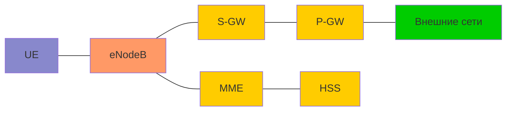

**Эволюция LTE:**

1. **Release 8 (2008)** — первый стандарт LTE:
   - Теоретическая скорость до 300 Мбит/с "вниз" и 75 Мбит/с "вверх"
   - Поддержка MIMO 4×4 в направлении "вниз"
   - Задержки менее 10 мс
   - FDD (Frequency-Division Duplex) и TDD (Time-Division Duplex) варианты

2. **Release 9 (2009)** — малые улучшения:
   - Усовершенствования MBMS
   - Поддержка позиционирования абонентов
   - Улучшения в Home eNodeB (малые соты)

3. **Release 10 (2011)** — LTE-Advanced:
   - Соответствие требованиям IMT-Advanced для сетей 4G
   - Агрегация несущих (Carrier Aggregation) — до 100 МГц
   - Расширенное использование MIMO (до 8×8)
   - Скорость до 1 Гбит/с "вниз" и 500 Мбит/с "вверх"
   - Улучшенная поддержка гетерогенных сетей (HetNet)
   - Координированная многоточечная передача (CoMP)

4. **Release 11 (2012)** — улучшения LTE-Advanced:
   - Улучшения в координации межсотовых помех (eICIC)
   - Улучшения в адаптации канала
   - Развитие технологии CoMP

5. **Release 12 (2014)** — дальнейшие улучшения:
   - Малые соты и двойная связность (Dual Connectivity)
   - Агрегация несущих FDD и TDD
   - 3D MIMO (трехмерные диаграммы направленности)
   - Передача голоса по сети LTE (VoLTE) и WiFi (VoWiFi)

6. **Release 13 (2015)** — предварительный этап к 5G:
   - LTE для устройств межмашинного взаимодействия (LTE-M)
   - Узкополосный Интернет вещей (NB-IoT)
   - LTE в нелицензируемом спектре (LTE-U, LAA)
   - Повышение спектральной эффективности

7. **Release 14 (2017)** — последний релиз LTE перед 5G:
   - Дальнейшие улучшения для IoT
   - Поддержка связи V2X (Vehicle-to-Everything)
   - Повышение максимальной скорости передачи
   - Улучшения для критически важных коммуникаций

#### WiMAX (Worldwide Interoperability for Microwave Access)

WiMAX — технология беспроводной связи, основанная на стандарте IEEE 802.16. Мобильный WiMAX (IEEE 802.16e) и WiMAX 2 (IEEE 802.16m) рассматривались как технологии 4G, альтернативные LTE.

**Ключевые характеристики:**
- Использование технологии OFDMA
- Поддержка фиксированного и мобильного доступа
- Частотные диапазоны: 2,3, 2,5, 3,5 ГГц и другие
- Полоса частот: от 1,25 до 20 МГц
- Дальность действия: до нескольких километров
- Скорость передачи данных: до 75 Мбит/с в ранних версиях

**Эволюция WiMAX:**

1. **IEEE 802.16 (2001)** — первая версия стандарта:
   - Фиксированный беспроводной доступ
   - Диапазон 10-66 ГГц
   - Требование прямой видимости

2. **IEEE 802.16a/d (2004)** — расширение стандарта:
   - Диапазон 2-11 ГГц
   - Не требует прямой видимости
   - Улучшенная поддержка QoS

3. **IEEE 802.16e (2005)** — мобильный WiMAX:
   - Поддержка мобильности до 120 км/ч
   - Увеличение дальности действия
   - Улучшенная устойчивость к многолучевому распространению

4. **IEEE 802.16m (2011)** — WiMAX 2:
   - Соответствие требованиям IMT-Advanced для сетей 4G
   - Скорость до 1 Гбит/с для фиксированных станций
   - Скорость до 100 Мбит/с для мобильных станций
   - Поддержка MIMO и расширенные методы модуляции
   - Обратная совместимость с IEEE 802.16e

**Сравнение WiMAX и LTE:**
- Обе технологии используют схожие технические принципы (OFDMA, MIMO)
- LTE получил более широкое распространение благодаря поддержке операторов мобильной связи
- WiMAX часто применялся для фиксированного беспроводного доступа
- WiMAX был доступен раньше, но LTE быстро догнал его по возможностям
- В конечном итоге LTE стал доминирующей технологией 4G

### Сравнительная характеристика поколений мобильной связи

| Характеристика | 3G (UMTS) | 3.5G (HSPA+) | 4G (LTE) | 4G+ (LTE-Advanced) |
|----------------|-----------|--------------|----------|-------------------|
| Год внедрения | 2001-2003 | 2007-2009 | 2010-2012 | 2013-2015 |
| Максимальная скорость "вниз" | 384 кбит/с - 2 Мбит/с | 14-42 Мбит/с | 100-300 Мбит/с | 300-1000 Мбит/с |
| Максимальная скорость "вверх" | 128-384 кбит/с | 5,8-11 Мбит/с | 50-75 Мбит/с | 150-500 Мбит/с |
| Задержка | 100-500 мс | 50-100 мс | 10-30 мс | <10 мс |
| Основная технология | WCDMA | HSPA, HSPA+ | OFDMA/SC-FDMA | OFDMA с Carrier Aggregation |
| Ширина канала | 5 МГц | 5 МГц | 1,4-20 МГц | До 100 МГц (агрегация) |
| Архитектура | Частично пакетная | Преимущественно пакетная | Полностью IP | Полностью IP |
| Основные услуги | Голос, данные | Интернет, мультимедиа | Высокоскоростной Интернет, HD видео | Ultra HD видео, дополненная реальность |

### Тенденции развития и переход к 5G

По мере развития технологий 3G и 4G и приближения к их теоретическим пределам, стала очевидной необходимость разработки нового поколения мобильной связи — 5G, которое должно обеспечить:

1. **Сверхвысокие скорости передачи данных** — до 20 Гбит/с

2. **Сверхнизкие задержки** — менее 1 мс

3. **Массовое подключение устройств** — до 1 миллиона устройств на 1 км²

4. **Высокую энергоэффективность** — увеличение срока службы батарей в 10 раз

5. **Улучшенную покрывающую способность** — включая глубокое проникновение в здания

6. **Поддержку различных сценариев использования**:
   - eMBB (enhanced Mobile Broadband) — расширенный мобильный широкополосный доступ
   - URLLC (Ultra-Reliable Low-Latency Communications) — сверхнадежная связь с низкими задержками
   - mMTC (massive Machine-Type Communications) — массовая межмашинная связь

Стандартизация 5G началась в Release 15 3GPP (2018 год) и продолжается в последующих релизах, при этом многие операторы используют инфраструктуру 4G LTE в качестве основы для внедрения первых сетей 5G (режим NSA — Non-Standalone).
