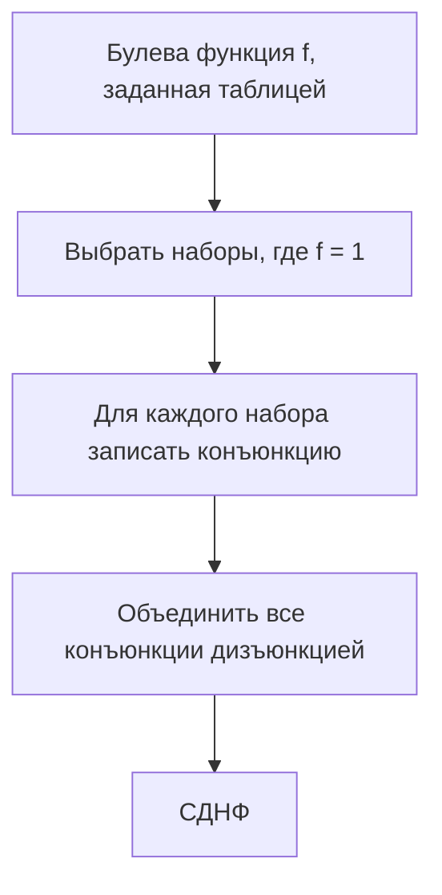
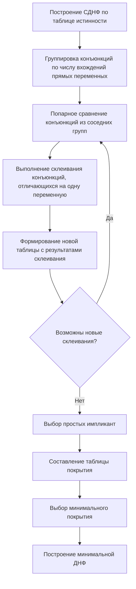
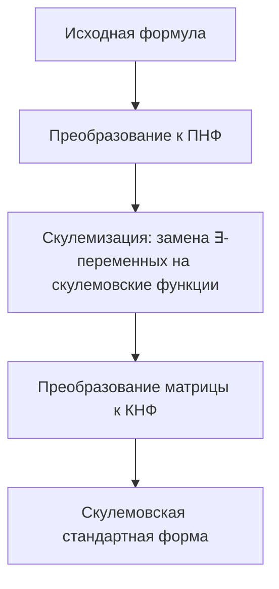

# Математическая логика и теория алгоритмов

## 1. Класс функций T0

### Определение класса T0

Класс функций T0 (класс функций, сохраняющих константу 0) — это множество всех булевых функций f(x₁, x₂, ..., xₙ), которые принимают значение 0, когда все переменные равны 0:

f(0, 0, ..., 0) = 0

Другими словами, класс T0 состоит из всех булевых функций, которые отображают нулевой набор в 0.

### Доказательство замкнутости класса T0

Для доказательства замкнутости класса T0 относительно операции суперпозиции нужно показать, что любая суперпозиция функций из T0 также принадлежит классу T0.

1. **Замкнутость относительно подстановки констант**: 
   Если f(x₁, x₂, ..., xₙ) ∈ T0 и некоторые переменные заменяются константами, то полученная функция также принадлежит T0.
   
   Если f(x₁, x₂, ..., xₙ) ∈ T0, то f(0, 0, ..., 0) = 0.
   
   При подстановке констант в некоторые аргументы получается функция g от меньшего числа переменных. Для набора (0, 0, ..., 0) значение g совпадает со значением f на наборе, где подставленные константы остаются, а все остальные аргументы равны 0. Поскольку f ∈ T0, то g также принадлежит T0.

2. **Замкнутость относительно перестановки переменных**:
   Если f(x₁, x₂, ..., xₙ) ∈ T0, то любая перестановка аргументов (например, f(x₂, x₁, ..., xₙ)) также дает функцию из T0.
   
   Это очевидно, так как f(0, 0, ..., 0) = 0, и при перестановке аргументов набор (0, 0, ..., 0) перейдет в себя.

3. **Замкнутость относительно суперпозиции**:
   Если f(x₁, x₂, ..., xₙ) ∈ T0 и g₁, g₂, ..., gₙ ∈ T0, то h(x) = f(g₁(x), g₂(x), ..., gₙ(x)) также принадлежит T0.
   
   Если все gᵢ ∈ T0, то gᵢ(0, 0, ..., 0) = 0 для всех i.
   
   Тогда h(0, 0, ..., 0) = f(g₁(0, 0, ..., 0), g₂(0, 0, ..., 0), ..., gₙ(0, 0, ..., 0)) = f(0, 0, ..., 0) = 0.
   
   Следовательно, h ∈ T0.

Таким образом, класс функций T0 замкнут относительно операции суперпозиции.

## 2. Класс функций T1

### Определение класса T1

Класс функций T1 (класс функций, сохраняющих константу 1) — это множество всех булевых функций f(x₁, x₂, ..., xₙ), которые принимают значение 1, когда все переменные равны 1:

f(1, 1, ..., 1) = 1

Другими словами, класс T1 состоит из всех булевых функций, которые отображают единичный набор в 1.

### Доказательство замкнутости класса T1

Для доказательства замкнутости класса T1 относительно операции суперпозиции нужно показать, что любая суперпозиция функций из T1 также принадлежит классу T1.

1. **Замкнутость относительно подстановки констант**: 
   Если f(x₁, x₂, ..., xₙ) ∈ T1 и некоторые переменные заменяются константами, то полученная функция также принадлежит T1.
   
   Если f(x₁, x₂, ..., xₙ) ∈ T1, то f(1, 1, ..., 1) = 1.
   
   При подстановке констант в некоторые аргументы получается функция g от меньшего числа переменных. Однако, если константы отличны от 1, то это не гарантирует, что g ∈ T1. Поэтому нужно рассмотреть случай, когда все подстановки равны 1.
   
   Если подставляются только константы 1, то при наборе (1, 1, ..., 1) значение g совпадает со значением f на наборе из одних единиц. Поскольку f ∈ T1, то g также принадлежит T1.

2. **Замкнутость относительно перестановки переменных**:
   Если f(x₁, x₂, ..., xₙ) ∈ T1, то любая перестановка аргументов (например, f(x₂, x₁, ..., xₙ)) также дает функцию из T1.
   
   Это очевидно, так как f(1, 1, ..., 1) = 1, и при перестановке аргументов набор (1, 1, ..., 1) перейдет в себя.

3. **Замкнутость относительно суперпозиции**:
   Если f(x₁, x₂, ..., xₙ) ∈ T1 и g₁, g₂, ..., gₙ ∈ T1, то h(x) = f(g₁(x), g₂(x), ..., gₙ(x)) также принадлежит T1.
   
   Если все gᵢ ∈ T1, то gᵢ(1, 1, ..., 1) = 1 для всех i.
   
   Тогда h(1, 1, ..., 1) = f(g₁(1, 1, ..., 1), g₂(1, 1, ..., 1), ..., gₙ(1, 1, ..., 1)) = f(1, 1, ..., 1) = 1.
   
   Следовательно, h ∈ T1.

Таким образом, класс функций T1 замкнут относительно операции суперпозиции.

## 3. Построение СДНФ для функции, заданной таблицей

### Определение СДНФ

Совершенная дизъюнктивная нормальная форма (СДНФ) булевой функции f(x₁, x₂, ..., xₙ) — это дизъюнкция элементарных конъюнкций, каждая из которых соответствует набору значений переменных, на котором функция принимает значение 1. При этом в каждую элементарную конъюнкцию входят все переменные либо в прямом, либо в инверсном виде.

### Алгоритм построения СДНФ

1. **Выявление наборов, на которых функция равна 1**:
   По таблице истинности выбираются все наборы значений переменных (x₁, x₂, ..., xₙ), на которых функция f принимает значение 1.

2. **Формирование элементарных конъюнкций**:
   Для каждого такого набора (a₁, a₂, ..., aₙ) формируется элементарная конъюнкция, в которую входят все переменные:
   - Если aᵢ = 1, то в конъюнкцию включается xᵢ
   - Если aᵢ = 0, то в конъюнкцию включается ¬xᵢ

3. **Построение СДНФ**:
   СДНФ получается путем объединения всех полученных элементарных конъюнкций операцией дизъюнкции (логическое ИЛИ).

### Пример построения СДНФ

Пусть задана функция f(x₁, x₂, x₃) следующей таблицей истинности:

| x₁ | x₂ | x₃ | f |
|----|----|----|---|
| 0  | 0  | 0  | 0 |
| 0  | 0  | 1  | 1 |
| 0  | 1  | 0  | 0 |
| 0  | 1  | 1  | 0 |
| 1  | 0  | 0  | 1 |
| 1  | 0  | 1  | 0 |
| 1  | 1  | 0  | 1 |
| 1  | 1  | 1  | 1 |

1. Выбираем наборы, на которых f = 1:
   - (0, 0, 1)
   - (1, 0, 0)
   - (1, 1, 0)
   - (1, 1, 1)

2. Формируем элементарные конъюнкции:
   - Для набора (0, 0, 1): ¬x₁ ∧ ¬x₂ ∧ x₃
   - Для набора (1, 0, 0): x₁ ∧ ¬x₂ ∧ ¬x₃
   - Для набора (1, 1, 0): x₁ ∧ x₂ ∧ ¬x₃
   - Для набора (1, 1, 1): x₁ ∧ x₂ ∧ x₃

3. Строим СДНФ:
   f(x₁, x₂, x₃) = (¬x₁ ∧ ¬x₂ ∧ x₃) ∨ (x₁ ∧ ¬x₂ ∧ ¬x₃) ∨ (x₁ ∧ x₂ ∧ ¬x₃) ∨ (x₁ ∧ x₂ ∧ x₃)

Используя стандартные обозначения:
f(x₁, x₂, x₃) = x̄₁x̄₂x₃ ∨ x₁x̄₂x̄₃ ∨ x₁x₂x̄₃ ∨ x₁x₂x₃

## 4. Построение СКНФ для функции, заданной таблицей

### Определение СКНФ

Совершенная конъюнктивная нормальная форма (СКНФ) булевой функции f(x₁, x₂, ..., xₙ) — это конъюнкция элементарных дизъюнкций, каждая из которых соответствует набору значений переменных, на котором функция принимает значение 0. При этом в каждую элементарную дизъюнкцию входят все переменные либо в прямом, либо в инверсном виде.

### Алгоритм построения СКНФ

1. **Выявление наборов, на которых функция равна 0**:
   По таблице истинности выбираются все наборы значений переменных (x₁, x₂, ..., xₙ), на которых функция f принимает значение 0.

2. **Формирование элементарных дизъюнкций**:
   Для каждого такого набора (a₁, a₂, ..., aₙ) формируется элементарная дизъюнкция, в которую входят все переменные:
   - Если aᵢ = 0, то в дизъюнкцию включается xᵢ
   - Если aᵢ = 1, то в дизъюнкцию включается ¬xᵢ

3. **Построение СКНФ**:
   СКНФ получается путем объединения всех полученных элементарных дизъюнкций операцией конъюнкции (логическое И).

### Пример построения СКНФ

Используем ту же функцию f(x₁, x₂, x₃), что и в предыдущем примере:

| x₁ | x₂ | x₃ | f |
|----|----|----|---|
| 0  | 0  | 0  | 0 |
| 0  | 0  | 1  | 1 |
| 0  | 1  | 0  | 0 |
| 0  | 1  | 1  | 0 |
| 1  | 0  | 0  | 1 |
| 1  | 0  | 1  | 0 |
| 1  | 1  | 0  | 1 |
| 1  | 1  | 1  | 1 |

1. Выбираем наборы, на которых f = 0:
   - (0, 0, 0)
   - (0, 1, 0)
   - (0, 1, 1)
   - (1, 0, 1)

2. Формируем элементарные дизъюнкции:
   - Для набора (0, 0, 0): x₁ ∨ x₂ ∨ x₃
   - Для набора (0, 1, 0): x₁ ∨ ¬x₂ ∨ x₃
   - Для набора (0, 1, 1): x₁ ∨ ¬x₂ ∨ ¬x₃
   - Для набора (1, 0, 1): ¬x₁ ∨ x₂ ∨ ¬x₃

3. Строим СКНФ:
   f(x₁, x₂, x₃) = (x₁ ∨ x₂ ∨ x₃) ∧ (x₁ ∨ ¬x₂ ∨ x₃) ∧ (x₁ ∨ ¬x₂ ∨ ¬x₃) ∧ (¬x₁ ∨ x₂ ∨ ¬x₃)

## 5. Определение логического следствия и теоремы

### Определение логического следствия

Логическое следствие — это отношение между формулами (высказываниями) в логике, при котором одна формула (следствие) обязательно истинна, если истинны другие формулы (посылки).

Формально: формула B является логическим следствием формул A₁, A₂, ..., Aₙ (обозначается A₁, A₂, ..., Aₙ ⊨ B), если для любой интерпретации I, в которой все формулы A₁, A₂, ..., Aₙ истинны, формула B также истинна.

В терминах теории моделей: B является логическим следствием A₁, A₂, ..., Aₙ, если любая модель множества формул {A₁, A₂, ..., Aₙ} является также моделью формулы B.

### Теорема 1 о логическом следствии

**Теорема 1**: Формула B является логическим следствием формул A₁, A₂, ..., Aₙ тогда и только тогда, когда формула (A₁ ∧ A₂ ∧ ... ∧ Aₙ) → B является тавтологией.

**Доказательство**:

1. Пусть B является логическим следствием A₁, A₂, ..., Aₙ. Нужно доказать, что (A₁ ∧ A₂ ∧ ... ∧ Aₙ) → B — тавтология.
   
   Предположим, что (A₁ ∧ A₂ ∧ ... ∧ Aₙ) → B не является тавтологией. Тогда существует интерпретация I, в которой (A₁ ∧ A₂ ∧ ... ∧ Aₙ) истинно, а B ложно. Но это противоречит тому, что B является логическим следствием A₁, A₂, ..., Aₙ, так как по определению, если все посылки истинны, то и следствие должно быть истинным.

2. Пусть (A₁ ∧ A₂ ∧ ... ∧ Aₙ) → B — тавтология. Нужно доказать, что B является логическим следствием A₁, A₂, ..., Aₙ.
   
   Пусть I — произвольная интерпретация, в которой все формулы A₁, A₂, ..., Aₙ истинны. Тогда в этой интерпретации конъюнкция (A₁ ∧ A₂ ∧ ... ∧ Aₙ) также истинна. Поскольку (A₁ ∧ A₂ ∧ ... ∧ Aₙ) → B — тавтология, то в интерпретации I формула B также истинна. Таким образом, B является логическим следствием A₁, A₂, ..., Aₙ.

### Теорема 2 о логическом следствии

**Теорема 2**: Формула B является логическим следствием формул A₁, A₂, ..., Aₙ тогда и только тогда, когда формула (A₁ ∧ A₂ ∧ ... ∧ Aₙ ∧ ¬B) противоречива (невыполнима).

**Доказательство**:

1. Пусть B является логическим следствием A₁, A₂, ..., Aₙ. Нужно доказать, что (A₁ ∧ A₂ ∧ ... ∧ Aₙ ∧ ¬B) противоречива.
   
   Предположим, что формула (A₁ ∧ A₂ ∧ ... ∧ Aₙ ∧ ¬B) выполнима. Тогда существует интерпретация I, в которой эта формула истинна. Это означает, что в I все формулы A₁, A₂, ..., Aₙ истинны, а B ложна. Но это противоречит тому, что B является логическим следствием A₁, A₂, ..., Aₙ, так как по определению, если все посылки истинны, то и следствие должно быть истинным.

2. Пусть (A₁ ∧ A₂ ∧ ... ∧ Aₙ ∧ ¬B) противоречива. Нужно доказать, что B является логическим следствием A₁, A₂, ..., Aₙ.
   
   Пусть I — произвольная интерпретация, в которой все формулы A₁, A₂, ..., Aₙ истинны. Предположим, что в этой интерпретации формула B ложна. Тогда в I формула ¬B истинна, а значит, истинна и конъюнкция (A₁ ∧ A₂ ∧ ... ∧ Aₙ ∧ ¬B). Но это противоречит тому, что (A₁ ∧ A₂ ∧ ... ∧ Aₙ ∧ ¬B) невыполнима. Следовательно, в интерпретации I формула B истинна, что и доказывает, что B является логическим следствием A₁, A₂, ..., Aₙ.

## 6. Алгоритм Куайна-МакКлоски для перечисления простых импликантов

### Определение импликанты и простой импликанты

**Импликанта** булевой функции f — это конъюнкция литералов (переменных или их отрицаний), такая что если эта конъюнкция истинна, то и функция f истинна.

**Простая импликанта** булевой функции f — это такая импликанта, что удаление любого литерала из неё приводит к конъюнкции, которая уже не является импликантой для f.

### Алгоритм Куайна-МакКлоски

Алгоритм Куайна-МакКлоски используется для нахождения всех простых импликант булевой функции и последующего построения минимальной ДНФ.

### Шаги алгоритма в общем виде

1. **Построение СДНФ**:
   Для заданной булевой функции f строится совершенная дизъюнктивная нормальная форма (СДНФ).

2. **Инициализация**:
   Конъюнкции из СДНФ группируются по числу вхождений прямых переменных (т.е. переменных без отрицания).

3. **Этап 1: Нахождение простых импликант**:
   a. Конъюнкции из соседних групп (отличающихся на 1 по числу прямых переменных) попарно сравниваются.
   b. Если две конъюнкции отличаются только в одной переменной (одна содержит переменную, другая — её отрицание), то выполняется операция склеивания: образуется новая конъюнкция, не содержащая этой переменной.
   c. Исходные конъюнкции помечаются как использованные в склеивании.
   d. Процесс продолжается до тех пор, пока возможны новые склеивания.
   e. Все конъюнкции, не помеченные как использованные в склеивании, являются простыми импликантами.

4. **Этап 2: Построение минимальной ДНФ**:
   a. Составляется таблица покрытия, где строки соответствуют простым импликантам, а столбцы — наборам значений переменных, на которых функция f принимает значение 1.
   b. В ячейке таблицы ставится отметка, если соответствующая простая импликанта принимает значение 1 на соответствующем наборе.
   c. Выбираются обязательные простые импликанты (те, которые единственные покрывают хотя бы один набор).
   d. Для оставшихся непокрытыми наборов решается задача о минимальном покрытии.

5. **Построение результата**:
   Минимальная ДНФ получается как дизъюнкция выбранных простых импликант.

## 7. Предваренная нормальная форма (ПНФ) и алгоритм преобразования

### Определение предваренной нормальной формы

Предваренная нормальная форма (ПНФ) — это форма записи формулы логики предикатов, в которой все кванторы вынесены в начало формулы (образуют префикс), а за ними следует бескванторная часть (матрица).

Общий вид ПНФ:
Q₁x₁ Q₂x₂ ... Qₙxₙ M(x₁, x₂, ..., xₙ)

где Q₁, Q₂, ..., Qₙ — кванторы (∀ или ∃), а M — бескванторная формула, называемая матрицей.

### 10 правил преобразования для ПНФ

1. **Устранение импликации**:
   A → B эквивалентно ¬A ∨ B

2. **Устранение эквивалентности**:
   A ↔ B эквивалентно (A → B) ∧ (B → A), или после устранения импликации: (¬A ∨ B) ∧ (¬B ∨ A)

3. **Ограничение области действия отрицания**:
   - ¬(A ∧ B) эквивалентно ¬A ∨ ¬B (закон де Моргана)
   - ¬(A ∨ B) эквивалентно ¬A ∧ ¬B (закон де Моргана)
   - ¬¬A эквивалентно A (закон двойного отрицания)

4. **Переименование связанных переменных**:
   Если x связана квантором и в формуле есть другая переменная с тем же именем, то x переименовывается для устранения конфликта имен.

5. **Устранение отрицания перед кванторами**:
   - ¬(∀x A(x)) эквивалентно ∃x ¬A(x)
   - ¬(∃x A(x)) эквивалентно ∀x ¬A(x)

6. **Вынесение кванторов за скобки**:
   - (∀x A(x)) ∧ B эквивалентно ∀x (A(x) ∧ B), если x не входит свободно в B
   - (∃x A(x)) ∧ B эквивалентно ∃x (A(x) ∧ B), если x не входит свободно в B
   - (∀x A(x)) ∨ B эквивалентно ∀x (A(x) ∨ B), если x не входит свободно в B
   - (∃x A(x)) ∨ B эквивалентно ∃x (A(x) ∨ B), если x не входит свободно в B

7. **Объединение одноименных кванторов**:
   - ∀x ∀y A(x, y) эквивалентно ∀y ∀x A(x, y)
   - ∃x ∃y A(x, y) эквивалентно ∃y ∃x A(x, y)

8. **Распределение кванторов над конъюнкцией и дизъюнкцией**:
   - ∀x (A(x) ∧ B(x)) эквивалентно (∀x A(x)) ∧ (∀x B(x))
   - ∃x (A(x) ∨ B(x)) эквивалентно (∃x A(x)) ∨ (∃x B(x))

9. **Выделение области действия квантора**:
   - ∀x (A(x) ∨ B) эквивалентно (∀x A(x)) ∨ B, если x не входит свободно в B
   - ∃x (A(x) ∧ B) эквивалентно (∃x A(x)) ∧ B, если x не входит свободно в B

10. **Преобразование матрицы к КНФ или ДНФ**:
    После вынесения всех кванторов матрица преобразуется к конъюнктивной или дизъюнктивной нормальной форме.

### Алгоритм преобразования формул в ПНФ

1. **Устранение импликации и эквивалентности**:
   Заменить все вхождения A → B на ¬A ∨ B и все вхождения A ↔ B на (¬A ∨ B) ∧ (¬B ∨ A).

2. **Ограничение области действия отрицания**:
   С помощью законов де Моргана и двойного отрицания преобразовать формулу так, чтобы отрицания стояли только перед атомарными формулами или кванторами.

3. **Переименование связанных переменных**:
   Переименовать связанные переменные так, чтобы каждая переменная была связана только одним квантором и не совпадала по имени со свободными переменными.

4. **Устранение отрицания перед кванторами**:
   Заменить ¬∀x A(x) на ∃x ¬A(x) и ¬∃x A(x) на ∀x ¬A(x).

5. **Вынесение кванторов за скобки**:
   Вынести все кванторы в начало формулы, используя правила вынесения кванторов за скобки и правила распределения кванторов.

6. **Преобразование матрицы**:
   Преобразовать бескванторную часть (матрицу) к конъюнктивной или дизъюнктивной нормальной форме.

## 8. Скулемовская стандартная форма и процедура преобразования

### Определение скулемовской стандартной формы

Скулемовская стандартная форма — это предваренная нормальная форма, в которой:
1. Все кванторы вынесены в начало формулы.
2. Все кванторы существования (∃) устранены путем их замены на функции (скулемовские функции) от переменных, связанных кванторами всеобщности (∀), которые предшествуют данному квантору существования.
3. Префикс содержит только кванторы всеобщности (∀).
4. Матрица преобразована к конъюнктивной нормальной форме.

### Процедура преобразования формул в скулемовскую стандартную форму

1. **Преобразование к предваренной нормальной форме**:
   Преобразовать формулу к предваренной нормальной форме с помощью алгоритма, описанного выше.

2. **Скулемизация** (устранение кванторов существования):
   a. Если квантор существования ∃y не находится в области действия ни одного квантора всеобщности, то переменная y заменяется на новую константу c (скулемовскую константу).
   b. Если квантор существования ∃y находится в области действия кванторов всеобщности ∀x₁, ∀x₂, ..., ∀xₙ, то переменная y заменяется на терм f(x₁, x₂, ..., xₙ), где f — новая функциональная константа (скулемовская функция).
   c. После замены квантор ∃y удаляется из префикса.

3. **Преобразование матрицы к КНФ**:
   Преобразовать бескванторную часть (матрицу) к конъюнктивной нормальной форме.

### Пример преобразования

Рассмотрим формулу: ∀x (P(x) → ∃y Q(x, y))

1. Устранение импликации:
   ∀x (¬P(x) ∨ ∃y Q(x, y))

2. Преобразование к ПНФ (вынесение кванторов):
   ∀x ∃y (¬P(x) ∨ Q(x, y))

3. Скулемизация:
   ∃y находится в области действия ∀x, поэтому y заменяется на f(x), где f — новая скулемовская функция:
   ∀x (¬P(x) ∨ Q(x, f(x)))

4. Префикс содержит только кванторы ∀, а матрица уже находится в КНФ.

Итоговая скулемовская стандартная форма:
∀x (¬P(x) ∨ Q(x, f(x)))
