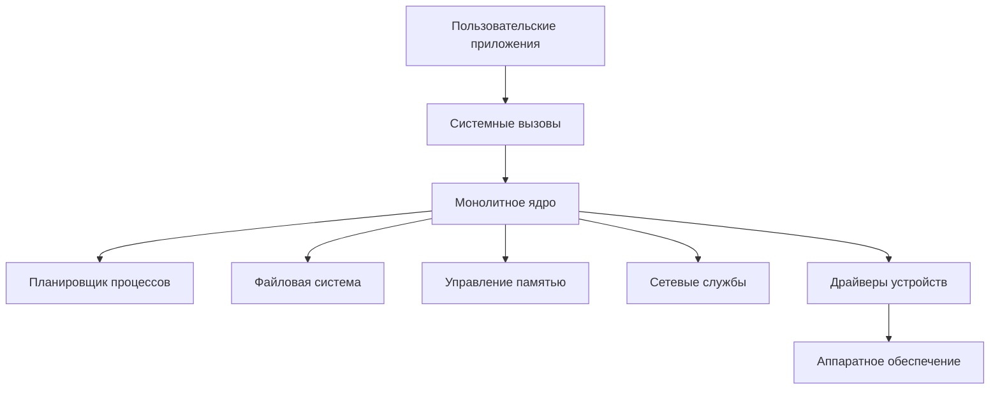
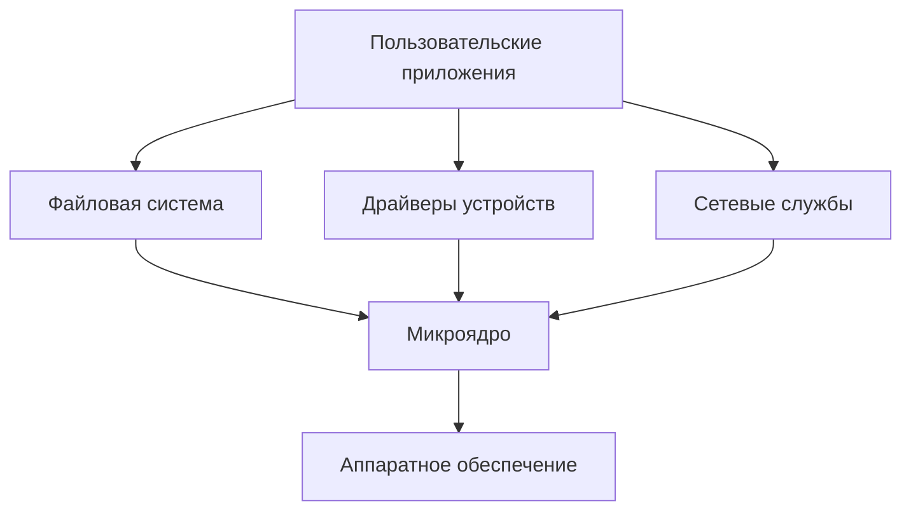
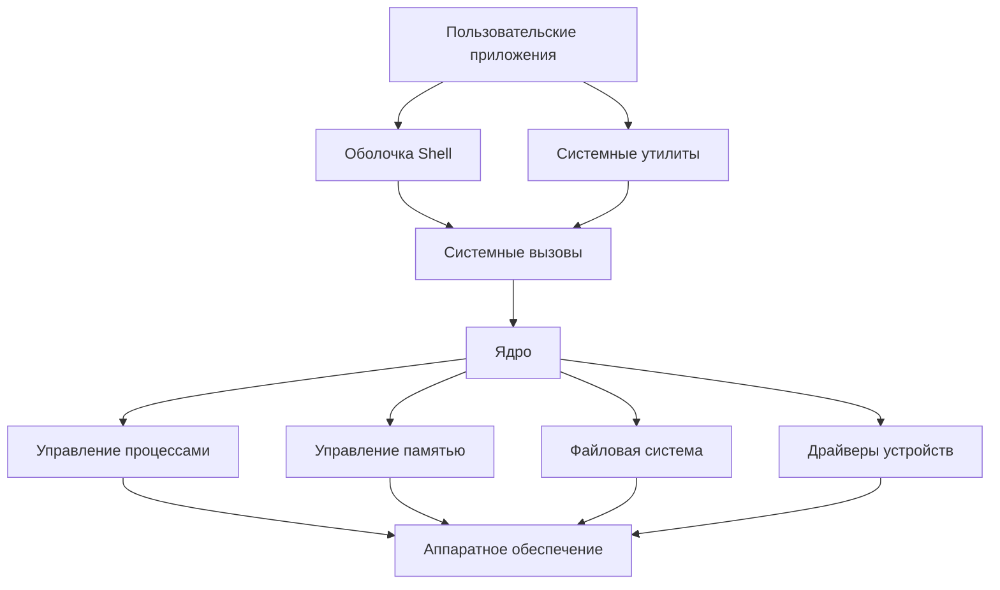
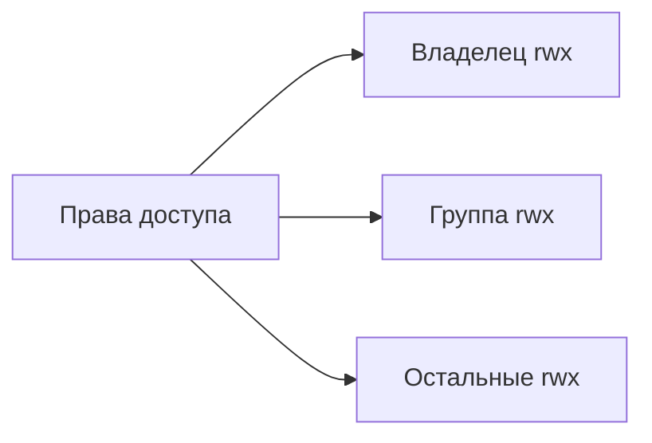
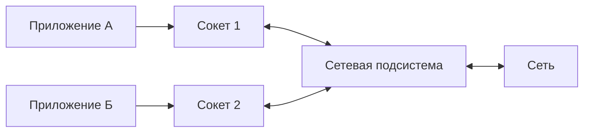
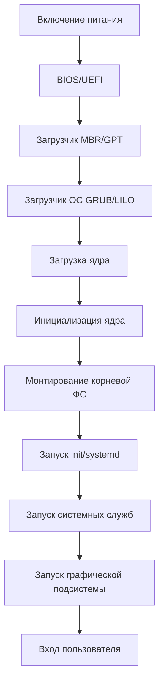

# Операционные системы

## 1. Монолитные операционные системы

Монолитная операционная система представляет собой архитектуру, в которой все компоненты ОС (планировщик процессов, файловая система, драйверы устройств, сетевые службы и др.) объединены в единое ядро, работающее в привилегированном режиме процессора.

### Архитектура монолитной ОС:



### Характеристики монолитных ОС:
- Высокая производительность за счет прямого вызова функций внутри ядра
- Сложность разработки и отладки из-за тесной связи компонентов
- Низкая отказоустойчивость (сбой в одном компоненте может привести к отказу всей системы)
- Требуют перекомпиляции всего ядра при добавлении новой функциональности

### Примеры монолитных ОС:
- Linux (с модульным ядром)
- MS-DOS
- ранние версии Windows (до NT)
- ранние версии Unix

### Микроядерные операционные системы:
В отличие от монолитных, микроядерные ОС имеют минимальное ядро, включающее только базовые функции (управление памятью, примитивы межпроцессного взаимодействия, базовое планирование). Остальные компоненты работают как отдельные процессы в пользовательском пространстве.



### Характеристики микроядерных ОС:
- Повышенная надежность и отказоустойчивость
- Модульность и легкость расширения
- Снижение производительности из-за межпроцессного взаимодействия
- Простота разработки и отладки отдельных компонентов

### Примеры микроядерных ОС:
- MINIX
- QNX
- Windows NT (хотя впоследствии стала гибридной)
- GNU Hurd

### Наноядерные операционные системы:
Наноядерные ОС представляют собой еще более минималистичный подход, где ядро содержит только механизмы виртуализации оборудования. Даже планировщик процессов и управление памятью находятся в пользовательском пространстве.

### Примеры наноядерных ОС:
- KeyKOS
- EROS
- Coyotos

## 2. Архитектура UNIX

UNIX — семейство операционных систем, разработанное в Bell Labs в начале 1970-х годов, которое оказало огромное влияние на развитие современных ОС.

### Основные компоненты UNIX:



### Файлы и устройства в UNIX:
В UNIX действует принцип "всё есть файл", согласно которому взаимодействие с устройствами и межпроцессное взаимодействие осуществляется через файловый интерфейс.

Типы файлов в UNIX:
- Обычные файлы (содержат данные)
- Каталоги (содержат метаданные о других файлах)
- Специальные файлы устройств:
  - Символьные (для последовательного доступа)
  - Блочные (для произвольного доступа)
- Символические ссылки
- Именованные каналы (FIFO)
- Сокеты (для сетевого взаимодействия)

### Процессы в UNIX:
Процесс в UNIX — это выполняющаяся программа с выделенным адресным пространством. Характеристики:
- Каждый процесс имеет уникальный идентификатор (PID)
- Создание новых процессов через системный вызов fork()
- Иерархия процессов (родитель-потомок)
- Замена выполняемого кода через exec()
- Межпроцессное взаимодействие через сигналы, каналы, сокеты, разделяемую память

### Драйверы файловой системы и их типы:
Драйвер файловой системы — это компонент ядра, отвечающий за организацию хранения и доступа к файлам на различных носителях.

Типы драйверов файловой системы в UNIX:
1. **Физические файловые системы**:
   - ext2/3/4, XFS, JFS в Linux
   - UFS, ZFS в BSD
   - HFS+ в macOS
   
2. **Виртуальные файловые системы**:
   - procfs (/proc) — доступ к данным ядра и процессов
   - sysfs (/sys) — информация об устройствах и драйверах
   - tmpfs — файловая система в оперативной памяти
   
3. **Сетевые файловые системы**:
   - NFS (Network File System)
   - SMB/CIFS (Server Message Block)
   - AFS (Andrew File System)

## 3. Основы информационной безопасности операционных систем

### Концепции безопасности UNIX:

1. **Многопользовательская модель**: UNIX изначально проектировалась как многопользовательская система с разделением полномочий.

2. **Модель доступа на основе прав**: файлы и процессы имеют атрибуты владельца и группы, определяющие права доступа.

3. **Принцип наименьших привилегий**: процессы должны работать с минимальным набором прав, необходимых для выполнения их функций.

4. **Изоляция процессов**: каждый процесс имеет отдельное адресное пространство.

5. **Разделение пользовательского и привилегированного режимов**: только ядро имеет прямой доступ к аппаратным ресурсам.

### Управление пользователями и правами доступа:

#### Пользователи и группы:
- Каждый пользователь имеет уникальный числовой идентификатор (UID)
- Пользователи могут быть объединены в группы, каждая с уникальным GID
- Суперпользователь (root, UID 0) имеет неограниченные права
- Информация о пользователях хранится в /etc/passwd и /etc/shadow
- Информация о группах хранится в /etc/group

#### Права доступа к файлам:
В UNIX используется 9-битная система прав доступа, представленная тремя наборами полномочий:
- для владельца (u)
- для группы (g)
- для остальных пользователей (o)

Каждый набор включает три типа прав:
- Чтение (r, 4)
- Запись (w, 2)
- Исполнение (x, 1)



#### Специальные биты:
- SUID (Set User ID): 4000, позволяет программе выполняться с правами владельца файла
- SGID (Set Group ID): 2000, позволяет программе выполняться с правами группы файла
- Sticky bit: 1000, позволяет удалять файлы только их владельцам (используется для /tmp)

#### Списки контроля доступа (ACL):
Расширение стандартной модели прав, позволяющее устанавливать более гибкие правила для отдельных пользователей и групп.

## 4. Понятие логической файловой системы

### Логическая файловая система:
Логическая файловая система представляет собой абстрактный интерфейс между пользовательскими программами и физической организацией данных на устройствах хранения. Она определяет:
- Структуру каталогов
- Правила именования файлов
- Метаданные файлов
- Операции с файлами (создание, чтение, запись и т.д.)

### Монтирование и демонтирование:
**Монтирование** — процесс подключения файловой системы на физическом устройстве к единому дереву файловой системы UNIX.

Процесс монтирования:
1. Файловая система проверяется на целостность
2. Суперблок считывается в память
3. Файловая система подключается к указанной точке монтирования в общем дереве

**Демонтирование** — процесс отключения файловой системы от дерева файловой системы.

Процесс демонтирования:
1. Все открытые файлы закрываются
2. Все буферы записываются на диск
3. Файловая система отсоединяется от дерева

```mermaid
graph TD
    A[Корневая файловая система /] --> B[/home]
    A --> C[/usr]
    A --> D[/var]
    A --> E[/mnt]
    E --> F[Точка монтирования]
    F --> G[Файловая система внешнего устройства]
```

### Физическая организация файловой системы:
Физическая организация описывает, как данные и метаданные хранятся на устройстве. Типичная структура включает:

1. **Суперблок**: содержит информацию о файловой системе в целом (размер, количество свободных блоков, и т.д.)

2. **Таблица индексных дескрипторов (inode)**: содержит метаданные файлов
   - Атрибуты файла (права доступа, владелец, размер, временные метки)
   - Указатели на блоки данных

3. **Блоки данных**: хранят содержимое файлов

4. **Блоки каталогов**: содержат связи между именами файлов и их индексными дескрипторами


Различные файловые системы (ext4, XFS, Btrfs и т.д.) имеют свои особенности физической организации, оптимизированные для определенных целей (производительность, надежность, эффективность использования пространства).

## 5. Сеть в UNIX

### Сетевая подсистема:
Сетевая подсистема UNIX отвечает за поддержку сетевых протоколов и предоставление интерфейсов для сетевого взаимодействия. Она включает:
- Драйверы сетевых устройств
- Реализации сетевых протоколов (TCP/IP, UDP и др.)
- API для сетевого программирования

### Общие принципы работы:
1. **Многоуровневая модель**: сетевой стек реализует уровни модели OSI
2. **Маршрутизация**: определение пути передачи пакетов
3. **Буферизация**: временное хранение данных для обработки
4. **Мультиплексирование**: обработка множества соединений

### Понятие сокетов:
Сокет — это программный интерфейс для межпроцессного взаимодействия через сеть. Представляет собой конечную точку сетевого соединения и определяется сочетанием:
- IP-адреса
- Номера порта
- Протокола передачи данных



### Типы сокетов:
1. **По области применения**:
   - **UNIX-сокеты** (AF_UNIX/AF_LOCAL): для межпроцессного взаимодействия на одном компьютере
   - **Интернет-сокеты** (AF_INET/AF_INET6): для взаимодействия через IP-сети

2. **По типу соединения**:
   - **Потоковые сокеты** (SOCK_STREAM): обеспечивают надежное двустороннее последовательное соединение (TCP)
   - **Датаграммные сокеты** (SOCK_DGRAM): передают отдельные пакеты без гарантии доставки и порядка (UDP)
   - **Сырые сокеты** (SOCK_RAW): обеспечивают доступ к низкоуровневым протоколам

### Общие принципы взаимодействия ОС через сокеты:
1. **Модель клиент-сервер**:
   - Сервер создает сокет, привязывает его к адресу, слушает и принимает подключения
   - Клиент создает сокет и подключается к серверу

2. **Базовые операции**:
   - **socket()**: создание сокета
   - **bind()**: привязка сокета к адресу
   - **listen()**: перевод сокета в режим прослушивания
   - **accept()**: принятие подключения
   - **connect()**: установка соединения с сервером
   - **send()/recv(), write()/read()**: передача и прием данных
   - **close()**: закрытие сокета

## 6. Управление службами операционной системы

### Системные службы:
Системные службы (демоны) — это программы, которые запускаются в фоновом режиме и обеспечивают различную функциональность операционной системы:
- Сетевые службы (SSH, FTP, HTTP)
- Служба печати
- Служба журналирования
- Служба времени
- Планировщики задач и т.д.

### Управление службами:
В современных UNIX-системах для управления службами используются различные системы инициализации:

#### 1. SysV init:
Традиционная система инициализации UNIX с запуском служб через скрипты в каталогах /etc/rc*.d в соответствии с уровнями выполнения.

Команды управления:
- `service <имя> start/stop/restart`
- `chkconfig`

#### 2. Systemd:
Современная система инициализации, используемая во многих дистрибутивах Linux, предоставляющая параллельный запуск, зависимости между службами, активацию по запросу.

Команды управления:
- `systemctl start/stop/restart/enable/disable <имя>.service`
- `journalctl` для просмотра логов

#### 3. Upstart:
Система инициализации, ориентированная на события, ранее использовалась в Ubuntu.

Команды управления:
- `start/stop/restart <имя>`
- `initctl`

### Загрузка операционной системы:
Процесс загрузки UNIX-системы происходит в несколько этапов:



1. **Загрузка ядра**: загрузчик находит и загружает ядро в память, передает ему контроль

2. **Инициализация ядра**:
   - Определение оборудования
   - Настройка подсистем ядра
   - Монтирование корневой файловой системы

3. **Запуск init/systemd**:
   - Первый процесс (PID 1)
   - Запуск остальных системных процессов
   - Переход в многопользовательский режим

4. **Запуск системных служб**:
   - Сетевая подсистема
   - Системные демоны
   - Службы аутентификации
   - Прочие службы согласно уровню запуска

5. **Запуск графической подсистемы** (если настроена):
   - X Window System / Wayland
   - Менеджер дисплея
   - Рабочее окружение
